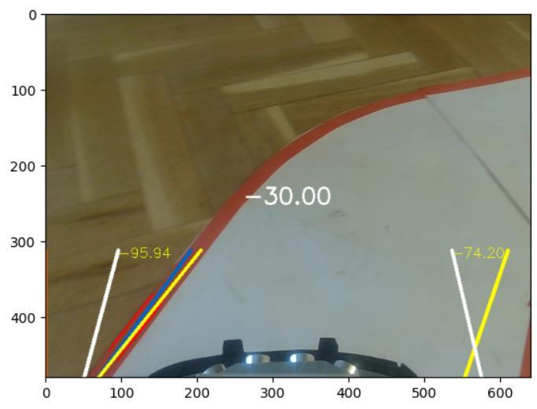

---
hide:
  - navigation
  - toc
---

# Robocar

Un coche RC autónomo construido desde cero, desde las baterías y el chasis hasta algoritmos de visión artificial, SLAM y navegación inteligente.

Diseñado, construido y programado como resultado de **dos Trabajos de Fin de Grado**
en la Universidad Politécnica de Madrid y un **Trabajo de Fin de Máster** en la UNIR.

[Explorar documentación](#evolucion-del-proyecto){ .md-button .md-button--primary }
[Ver en GitHub](https://github.com/rubenhigorg/robocar){ .md-button }

{ .hero-image }

---

## Evolución del proyecto { #evolucion-del-proyecto }

-   :material-wrench:{ .lg .middle } **TFG 1 — Diseño y Construcción**

    ---

    { .card-image }

    Chasis, electrónica, sensores, baterías, piezas 3D impresas, software ROS2 y panel de control Node-RED.

    **Coste total: ~293€**

    [:octicons-arrow-right-24: Ver documentación](tfg1-construccion/README.md)

-   :material-eye:{ .lg .middle } **TFG 2 — Seguimiento de Carril**

    ---

    { .card-image }

    Lane-following con OpenCV: filtro de color, Canny, Hough, Filtro de Kalman y control PID.

    **Velocidad autónoma: 18 cm/s**

    [:octicons-arrow-right-24: Ver documentación](tfg2-lane-following/README.md)

-   :material-radar:{ .lg .middle } **TFM — Navegación Inteligente**

    ---

    { .card-image }

    SLAM con RPLidar C1 + Cartographer, Nav2 para planificación de rutas, y control por lenguaje natural con LLM + MCP.

    **Estado: En desarrollo 🚧**

    [:octicons-arrow-right-24: Ver documentación](tfm/README.md)

---

## Arquitectura del Sistema

{ .arch-image }

### Diagrama de Conexiones Hardware

:material-circle:{ .legend-i2c } I²C Bus 1 · :material-circle:{ .legend-gpio } GPIO · :material-circle:{ .legend-pwm } PWM / Servo · :material-circle:{ .legend-usb } USB · :material-circle:{ .legend-pwr } Alimentación

  <iframe src="robocar_diagram.html" class="hw-diagram" loading="lazy"></iframe>

---

## El robot en cifras

-   :material-currency-eur:{ .lg .middle } **~293€**

    ---

    Coste total con componentes comerciales de bajo coste y celdas de batería recicladas

-   :material-chip:{ .lg .middle } **Raspberry Pi 4**

    ---

    Ubuntu 22.04 LTS, ROS2 Iron, 4 GB RAM

-   :material-video:{ .lg .middle } **6 sensores**

    ---

    Cámara, 3× ultrasonidos HC-SR04, IMU MPU6050 y monitorización energética

-   :material-gamepad-variant:{ .lg .middle } **2 modos**

    ---

    Manual (joystick PS3) y autónomo (seguimiento de carril por visión artificial)

---

## Modos de conducción

=== "Manual"

    Control directo con mando **DualShock 3** (PS3) por Bluetooth.
    Los ejes del joystick controlan dirección y velocidad de forma independiente.

=== "Autónomo"

    El `processing_node` detecta los carriles de la pista mediante visión artificial
    y publica correcciones de dirección que el `car_control_node` aplica automáticamente
    a velocidad constante (18 cm/s).

> **Cambio de modo:** Botón **X** del mando PS3

---

## Autores

| Nombre | Contribución |
|---|---|
| **Rubén Higuera Castillo** | TFG 1, TFG 2, TFM |
| **Kento Reinoso** | TFG 1 |

---

[:material-file-document: Recursos visuales](recursos-visuales.md) · [:material-github: Repositorio](https://github.com/rubenhigorg/robocar) · [:material-school: UPM](https://www.upm.es)

