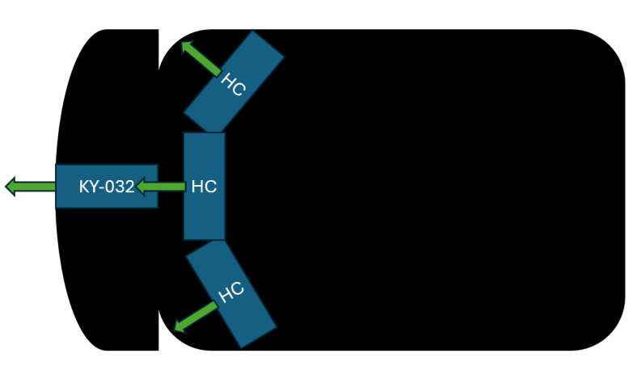
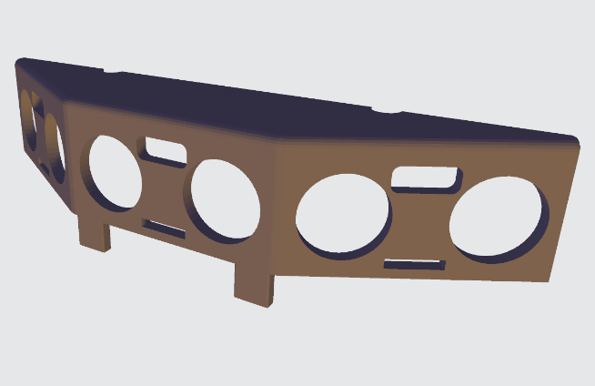
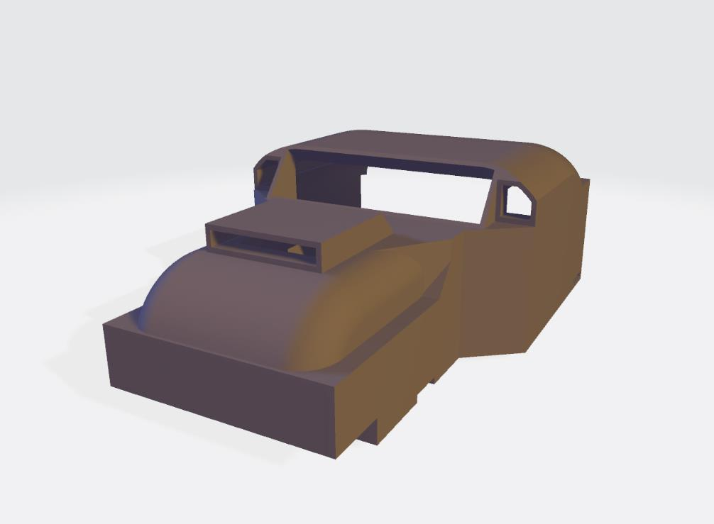
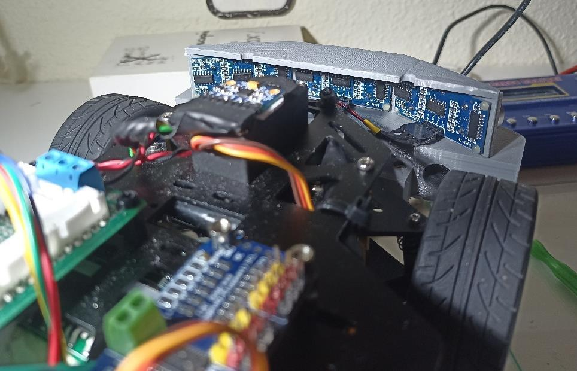
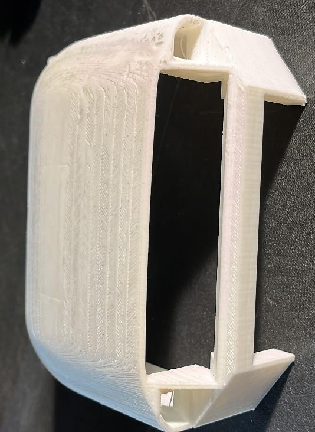
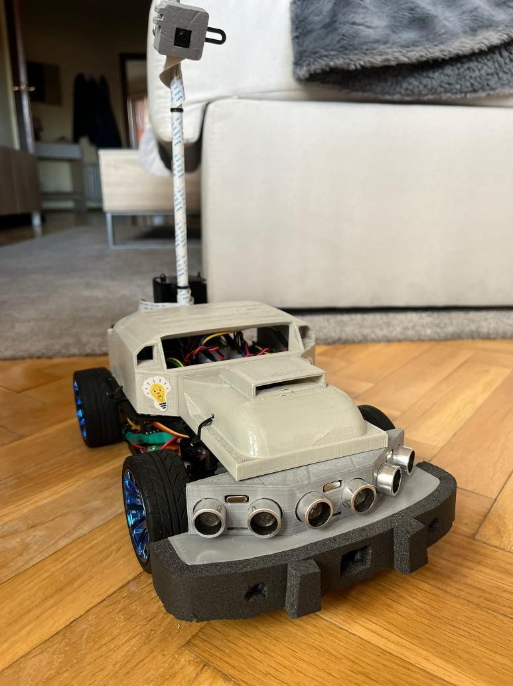

# Construcción: Montaje, Cableado y Piezas 3D

[← Volver al TFG1](README.md)

## Estrategia de Sensores

Basándose en los resultados del [benchmarking](hardware.md#benchmarking-de-sensores-de-distancia), se define la estrategia de sensorización:

### Distribución final

- **3× HC-SR04** en la parte frontal, separados **30°** entre sí → cobertura de 90° en dirección frontal
- **1× KY-032** integrado en el parachoques → detección de emergencia a <4.5cm
- **Sensorización trasera:** Pospuesta para líneas futuras

### Lógica de detección

| Sensor | Función | Prioridad |
|---|---|---|
| 3× HC-SR04 | Detección anticipada de obstáculos, rango medio-largo | Normal |
| KY-032 | Detección de última línea, obstáculo inminente | **Máxima** |

> La detección del KY-032 debe tratarse con máxima prioridad por la proximidad que supone.

## Conectividad Física

### Asignación de pines (GPIO)

| Funcionalidad | Pin GPIO | Pin físico |
|---|---|---|
| I2C SDA | GPIO 2 | Pin 3 |
| I2C SCL | GPIO 3 | Pin 5 |
| Trigger HC derecha | GPIO 23 | Pin 16 |
| Echo HC derecha | GPIO 24 | Pin 18 |
| Trigger HC centro | GPIO 5 | Pin 29 |
| Echo HC centro | GPIO 6 | Pin 31 |
| Trigger HC izquierda | GPIO 17 | Pin 11 |
| Echo HC izquierda | GPIO 27 | Pin 13 |

### Interfaces de datos

- **I2C:** Bus compartido para MPU6050, INA3221, INA226, PCA9685, VL53L0X (SDA/SCL, pines 3/5)
- **Digital GPIO:** 2 pines por cada HC-SR04 (Trigger + Echo)

### Interfaces de alimentación

- **5V:** Placa de distribución alimentada desde el BUCK
- **3.3V:** Directamente desde la Raspberry Pi

### Construcción de cables

Los cables para los HC-SR04 requieren un **divisor de tensión integrado** (R1=1kΩ, R2=2kΩ) directamente en el propio cable, debido a la falta de espacio para una placa adicional.

**Proceso:**
1. Seleccionar cable Dupont y cortar a longitud adecuada
2. Trenzar cables
3. Soldar uniones y divisor de tensión
4. Aplicar tubo termorretráctil en puntos delicados
5. **Probar cada cable** antes de instalación definitiva

## Raspberry Pi 4

### Sistema Operativo

- **Ubuntu 22.04 LTS** (64 bits), instalado con Raspberry Pi Imager
- Última versión compatible con **ROS2 Iron**
- Configuración de red y SSH durante la instalación
- Usuario: `lab`, contraseña: `lab`

### Desarrollo Remoto

- IDE: **Visual Studio Code** con extensión Remote-SSH
- Conexión: `ssh lab@robocar.local`
- Extensiones instaladas en el servidor: ROS, Pylance, GitHub Copilot

### Entorno Python

Entorno virtual (`.venv`) con todas las dependencias del proyecto. Las librerías hardware (smbus2, adafruit-circuitpython-servokit, etc.) se instalan dentro del venv.

## Diseño y Fabricación de Piezas 3D

### Requisitos

**Pieza de sensores:**
- Espacio para 3× HC-SR04 y 1× KY-032
- Los HC-SR04 separados 30° para cobertura frontal completa
- Incorporar parachoques protector
- KY-032 cerca del borde del parachoques, sin sobresalir

**Pieza de chasis:**
- No interferir con otros componentes
- Proteger componentes electrónicos y mecánicos
- Acabado estético profesional

### Diseño

Se utiliza **modelado paramétrico** con **Fusion 360** (licencia académica UPM):

1. Medición precisa de componentes
2. Bocetos a mano alzada para refinar ideas
3. Modelado 3D paramétrico
4. Verificación iterativa de dimensiones y requisitos

**Pieza de sensores** — diseñada en dos partes para facilitar desarrollo incremental modular:
- **Pieza inferior:** Soporte para KY-032 y faros, actúa como parachoques
- **Pieza superior:** Soporta los 3× HC-SR04 en la posición adecuada

### Herramientas

| Herramienta | Uso |
|---|---|
| **Fusion 360** | Modelado 3D paramétrico (archivos .f3d → exportación .stl) |
| **Cura** (Slicer) | Preparación para impresión (densidad relleno, temperaturas, grosor capas) |
| **Impresora 3D Anet A8** | Impresión con filamento PLA |

### Proceso de fabricación

1. Exportar modelo de Fusion 360 (.f3d → .stl)
2. Configurar en Cura y lanzar impresión
3. Supervisar impresión (posibles errores que requieren intervención)
4. **Post-procesado:** Lijado, eliminación de soportes, retocado manual de discrepancias
5. Integración: instalar sensores en piezas antes de montar en el chasis

**Integración de piezas:**
- *Pieza sensor superior:* Instalar HC-SR04 antes de incorporar al chasis
- *Pieza sensor inferior:* Instalar KY-032, faros y espuma amortiguadora
- *Pieza chasis:* Montaje directo sobre chasis (reordenar componentes previamente)

### Problemáticas Encontradas

- **Parametrización incorrecta:** Los diseños iniciales carecían de correcta parametrización, dificultando su edición posterior
- **Errores de impresión:** Fallos durante la impresión que no siempre pudieron identificarse, afectando calidad y funcionalidad de algunas piezas

## Otros Componentes

### Joystick PS3

Conexión del mando DualShock 3 por Bluetooth a la Raspberry Pi 4.

**Configuración:**
1. Instalar paquetes bluez: `sudo apt install bluez-*`
2. Editar `/etc/bluetooth/input.conf` para configuración del Bluetooth
3. Conectar por USB para emparejamiento inicial
4. Autorizar la conexión vía `bluetoothctl`

### Display de Batería 3S

Display conectado directamente a la salida del BMS que permite ver a simple vista el nivel de carga de la batería. Lectura rápida pero imprecisa.

