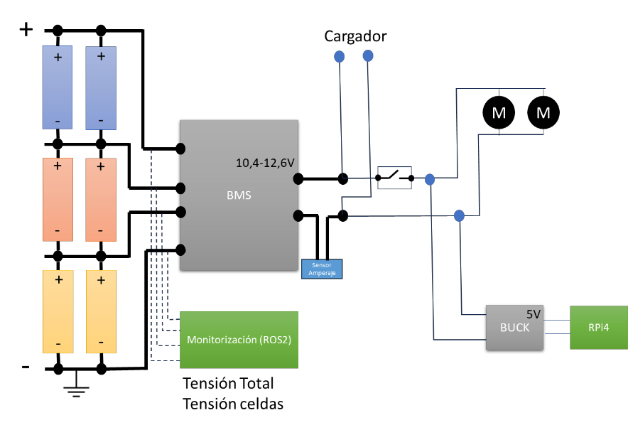
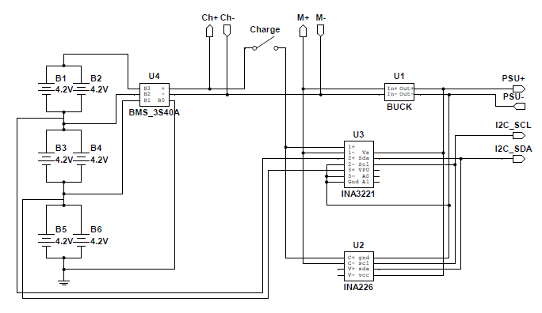
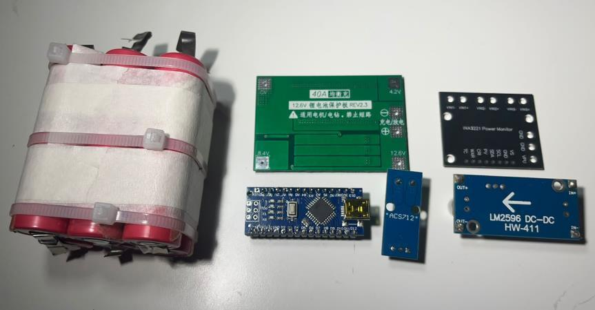
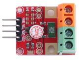
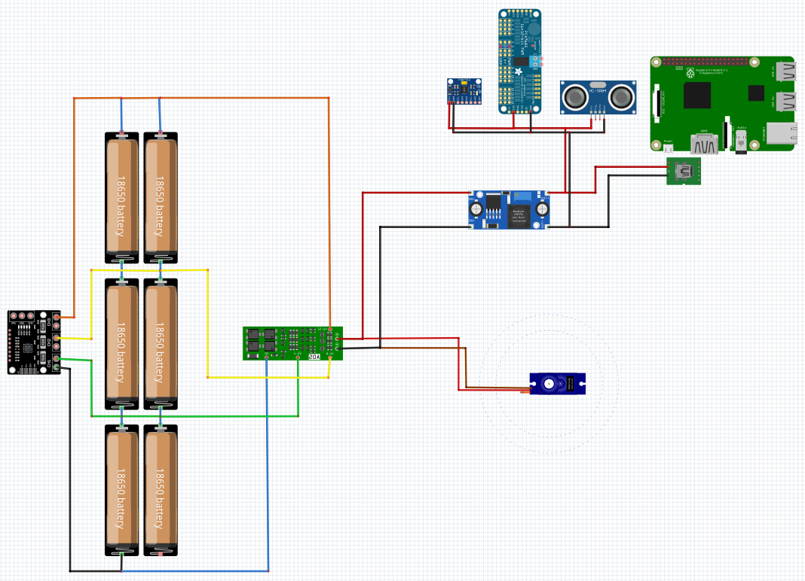
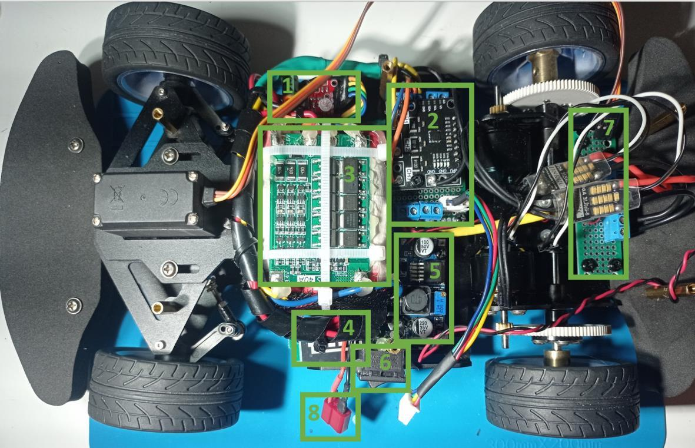

# Electrónica: Alimentación y Monitorización

[← Volver al TFG1](README.md)

## Visión General

El sistema de alimentación se diseña como una unidad que reutiliza componentes disponibles y cumple los requisitos de alimentación y monitorización del sistema. La batería está en configuración **2p3s** (2 celdas en paralelo × 3 conjuntos en serie) con un BMS (Battery Management System) para protección y balanceo.

## Requisitos

### Alimentación

| Tensión | Componentes |
|---|---|
| **12.6V** (batería directa) | Motores ESC |
| **5V** (vía BUCK) | Raspberry Pi, sensores |
| **3.3V** (vía Raspberry) | Algunos sensores |

### Protección (BMS)

- Protección contra picos de tensión
- Equilibrado de carga entre celdas (carga y descarga)
- BMS utilizado: **3S40A 12.6V Rev2.3** (soporta 3S, 12.6V a 0V)

### Monitorización

- Medir tensiones en 4 puntos independientes del BMS
- Medir corriente total del sistema
- Monitorizar equilibrado de carga

## Diseño

### Componentes

| Componente | Función |
|---|---|
| **6× celdas de iones de litio** | Almacenamiento (recicladas, config. 2p3s) |
| **BMS 3S40A 12.6V** | Protección y balanceo |
| **INA3221** | Monitor de tensión de 3 canales (I2C), rango 0–26V, error ≤0.25% |
| **INA226** | Monitor de corriente y potencia (I2C), 16 bits, hasta 36V |
| **LM2596 DC-DC (BUCK)** | Transformador de nivel 12.6V → 5V ajustable |
| **Display batería 3S** | Indicador visual del estado de carga |

### Alternativas evaluadas para monitorización

Se evaluaron tres configuraciones:

1. **Arduino Nano:** Suficientes canales ADC pero requiere protocolo de comunicación con la RPi y divisores de tensión (factor ½ y ⅓). Descartado por complejidad.
2. **2× INA (INA3221 + INA226):** INA3221 para 3 canales de tensión, INA226 para corriente. Interfaz I2C sencilla. ✅ **Seleccionado**
3. **1× INA3221 (3 canales):** Un solo sensor para todo. Descartado por interferencia mutua y pérdida de precisión en canal de doble funcionalidad.

### Diseño lógico final

```
Batería 2p3s ──► BMS ──┬──► 12.6V ──► Motores ESC
                       │              ──► BUCK ──► 5V ──► RPi, sensores
                       │
                       ├──► INA3221 (tensión 3 canales, I2C 0x41)
                       └──► INA226 (corriente, I2C 0x44)
```



### Configuración I2C de los sensores

| Sensor | Dirección | Configuración necesaria |
|---|---|---|
| **INA3221** | 0x41 | Conectar pin A0 a Vs (sin soldar) |
| **INA226** | 0x44 | Eliminar punto soldadura en pin A1 + agregar punto entre pin U y Vcc |



## Construcción

### Batería

1. Distribución de celdas en configuración 2×3
2. Conexiones 2p3s con cables gruesos de potencia
3. Conexión del BMS entre cada par de celdas
4. Acabado con malla cubre cables, bridas y pegamento termofusible
5. **Ubicación:** Centrada en el piso inferior del chasis (mayor estabilidad por distribución de peso)





### Pruebas

#### Prueba de potencia

Consumo estimado del sistema: ~230W (motores ~100W × 2, Raspberry ~10W, resto menor).

Se conectaron 4 resistencias de 50W en paralelo directamente a la batería, verificando >200W de potencia estable.

#### Prueba de sensores INA

- ✅ INA3221: Medición de tensión correcta en los 3 canales
- ✅ INA226: Medición de corriente correcta
- ❌ INA3221: Medición de corriente no satisfactoria (motivo por el que se usa INA226 para corriente)

### Componentes instalados

| ID | Componente |
|---|---|
| 1 | INA226 |
| 2 | INA3221 |
| 3 | BMS |
| 4 | Medidor de carga |
| 5 | BUCK (transformador de nivel) |
| 6 | Interruptor de encendido |
| 7 | Placa distribuidora 12.6V |
| 8 | Clema de carga |



### Distribución de alimentación

- **Piso inferior:** Batería centrada, INA's, BMS, BUCK, placa 12.6V
- **Piso superior:** Placa de distribución de 5V para todos los componentes excepto la RPi
- **RPi:** Alimentación directa desde BUCK vía USB-C


