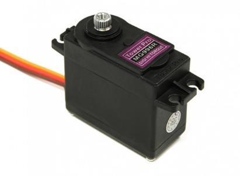
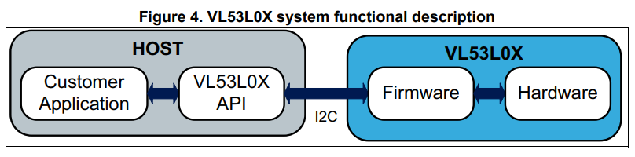
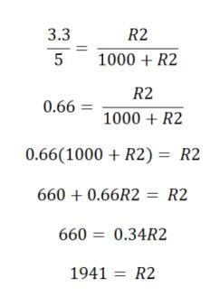
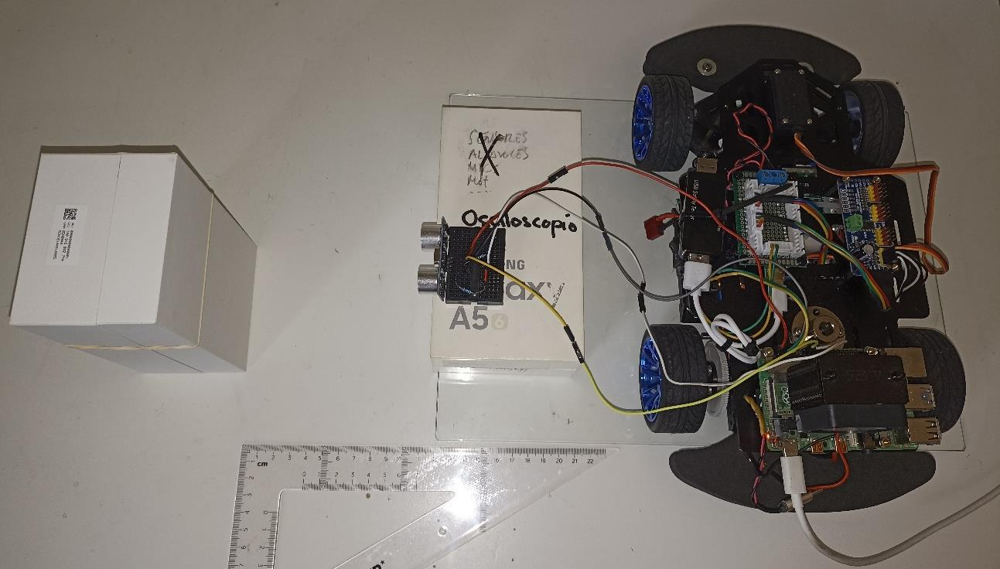
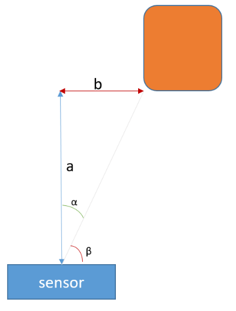

# Hardware: Actuadores, Sensores y Benchmarking

[← Volver al TFG1](README.md)

## Actuadores

### BLHeli_S (Motor ESC sin escobillas)

BLHeli_S es un firmware para controladores de velocidad electrónicos (ESC) basados en silicio, popular en drones de carreras y coches radiocontrol. Controla los motores del robot mediante señales PWM.

**Secuencia de armado:**

El controlador requiere una secuencia de inicialización específica y emite sonidos que indican su estado:

1. Señal de inicialización PWM
2. Secuencia de armado con confirmación sonora
3. Listo para recibir comandos de velocidad

### Servomotor MG996R

Servomotor robusto utilizado para el control de la dirección angular del robot. Se controla mediante señal PWM a través del PCA9685. Es el encargado de manejar el ángulo de giro de las ruedas delanteras (dirección tipo Ackermann, máximo ±30°).

### PCA9685

Controlador PWM de 16 canales con interfaz I2C. En este proyecto conecta:
- **Canales 0 y 1:** Motores ESC (tracción)
- **Canal 2:** Servomotor de dirección

Permite controlar los tres actuadores desde la Raspberry Pi a través de un único bus I2C.

---

## Sensores

### Clasificación

| Categoría | Sensores | Función |
|---|---|---|
| Distancia | VL53L0X, VL53L1X, VL6180X, HC-SR04, GP2Y0E03, KY-032 | Detección de obstáculos |
| Visión | RPi Camera Rev 1.3 | Captura de frames para procesamiento |
| Movimiento | MPU6050 (IMU 6-DoF) | Aceleración y velocidad angular |
| Eléctricos | INA3221, INA226 | Monitorización de batería |

### Sensores de Distancia

#### Comparativa teórica

| Sensor | Alimentación | Interfaz | Rango | Pros | Contras |
|---|---|---|---|---|---|
| **VL53L0X** | 2.6–3.5V | I2C | 30mm–2m | Precisión superior, funciona con IR ambiental, compensación cristal protector | Ángulo estrecho, coste algo mayor |
| **VL53L1X** | 2.6–3.5V | I2C | 40mm–4m | Mayor rango que VL53L0X, alta precisión a distancia | Mayor coste, no apto para distancias muy cortas |
| **VL6180X** | 2.6–3.6V | I2C | 5mm–200mm | Funciona con IR ambiental, buena precisión en corta distancia | Menor precisión y rango que VL53L0X/L1X |
| **HC-SR04** | 5V | Analógico | 2–400cm | Muy económico, fácil de usar, amplio rango | Precisión limitada por ecos, no apto para superficies irregulares |
| **GP2Y0E03** | 4.5–5.5V | Analógico | 4–50cm | Buen rendimiento en objetos cercanos | Limitado a 50cm, sensible a reflectancia |
| **KY-032** | 3.3–5V | Digital | 2–450cm | Muy económico, fácil de usar | Solo salida booleana, baja precisión |

### Cámara

**Raspberry Pi Camera Rev 1.3:**
- Resolución: 5 megapíxeles, video 1080p @ 30fps
- Interfaz: CSI (Camera Serial Interface)
- Compatible con Raspberry Pi 1, 2, 3 y 4
- Coste contenido, ideal para proyectos con presupuesto limitado

### MPU6050 (IMU)

Sensor inercial de 6 grados de libertad que combina acelerómetro de 3 ejes y giroscopio de 3 ejes. Comunicación I2C. Útil para detectar inclinaciones, golpes y movimiento del robot.

---

## Benchmarking de Sensores de Distancia

### Motivación

Identificar los sensores que ofrecen el mejor equilibrio entre precisión, coste y fiabilidad para las aplicaciones específicas del robot. La selección adecuada optimiza el rendimiento del sistema y reduce costos.

### Objetivos

Evaluar y comparar el rendimiento de los sensores bajo condiciones variables de distancia e iluminación, midiendo precisión, tiempo de respuesta y fiabilidad.

### Plan de Pruebas

**Variables:**
- **Distancia:** Corta (15cm), Media (50cm), Larga (3m)
- **Iluminación:** Normal (~150 lux), Baja (~2 lux)
- **Mínimo 3 repeticiones** por medición

**Métricas:** Precisión vs. distancia real, tiempo de respuesta, fiabilidad (consistencia de lecturas)

**Objeto target:** Ortoedro blanco de cartón (no reflectante, color similar al fondo)

### Sensores candidatos

De los 6 sensores iniciales, se descartaron durante la implementación:
- **GP2Y0E03:** Comportamiento errático e impredecible (medidas correctas e incorrectas alternando). Descartado.
- **KY-032:** Salida digital booleana, no comparable con los demás. Omitido del benchmarking (pero reutilizado como sensor de emergencia).

**Candidatos finales:** VL53L0X, VL6180X, HC-SR04

### Implementación de los sensores

| Sensor | Interfaz | Notas de implementación |
|---|---|---|
| **VL53L0X** | I2C | API en C del fabricante con máquina de estados. Librería Python específica. |
| **VL6180X** | I2C | Librería `adafruit_vl6180x`. |
| **HC-SR04** | GPIO (digital) | Requiere **divisor de tensión** (R1=1kΩ, R2=2kΩ) entre Echo y GPIO de la RPi para reducir 5V a 3.3V. |

### Resultados

#### Pruebas de distancia (valores en cm)

| Sensor | Luz | 3cm | 8cm | 15cm | 30cm | 60cm | 100cm |
|---|---|---|---|---|---|---|---|
| **HC-SR04** | Abundante | 4.76 | 6.57 | 13.5 | 28.27 | 58.95 | 100.24 |
| | Escasa | 4.5 | 6.82 | 14.4 | 29.8 | 59.93 | 100.5 |
| **VL6180X** | Abundante | 1.6 | 7.0 | 13.8 | 25.5* | 25.5* | 25.5* |
| | Escasa | 1.6 | 6.8 | 13.9 | 25.5* | 25.5* | 25.5* |
| **VL53L0X** | Abundante | 4.8 | 9.4 | 17 | 34.4 | 69.7 | 119.2 |
| | Escasa | 4.6 | 9.3 | 16.9 | 33.7 | 71.4 | 119.6 |

> *VL6180X satura a ~25.5cm (fuera de su rango especificado de 200mm)

#### Pruebas de ángulo (a 30cm, condiciones óptimas de luz)

| Sensor | 0° | 15° | 20° | 30° | 45° |
|---|---|---|---|---|---|
| **HC-SR04** | ✅ (28.65) | ✅ (33.07) | ❌ (59) | ❌ (61) | ❌ (60) |
| **VL6180X** | ✅ (14.7) | ❌ (25.5) | ❌ (25.5) | ❌ (25.5) | ❌ (25.5) |
| **VL53L0X** | ✅ (43.4) | ❌ (72.6) | ❌ (73.1) | ❌ (73.7) | ❌ (72.4) |

> ✅ = detección correcta (consistente con la distancia real), ❌ = detección errónea

### Conclusiones del Benchmarking

- Todos los sensores muestran capacidad de medición con errores aceptables (<20%) en sus rangos
- **La luz ambiental no afecta** de forma notable a ningún sensor
- **HC-SR04 es considerablemente más preciso** de lo esperado, especialmente en rango medio-largo
- Distancias muy cortas (<3cm) introducen errores significativos en todos los sensores
- **El ángulo de detección de todos los sensores es muy estrecho** (solo funciona a 0°)
- El KY-032 se reincorpora como sensor de emergencia para distancias <4.5cm
