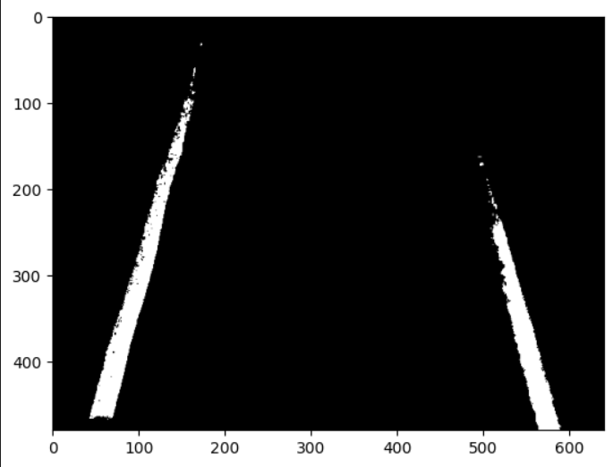
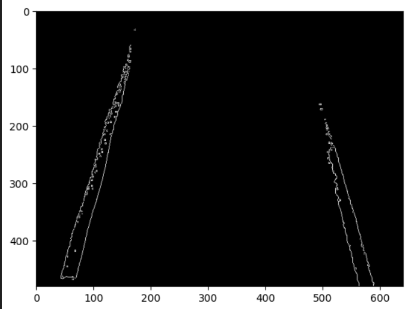
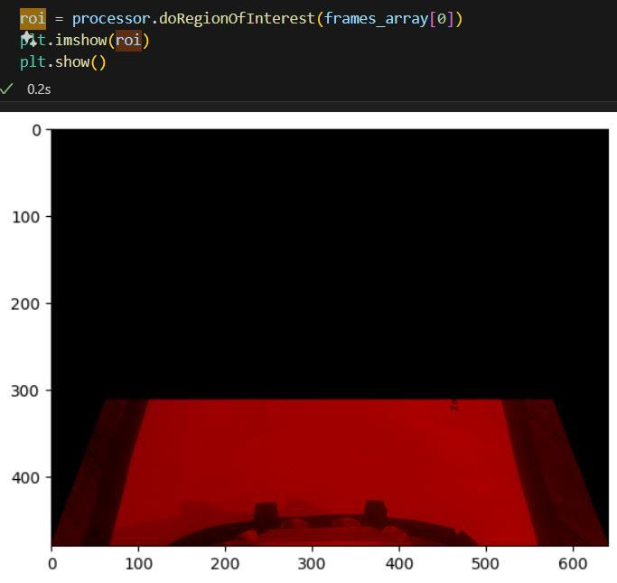
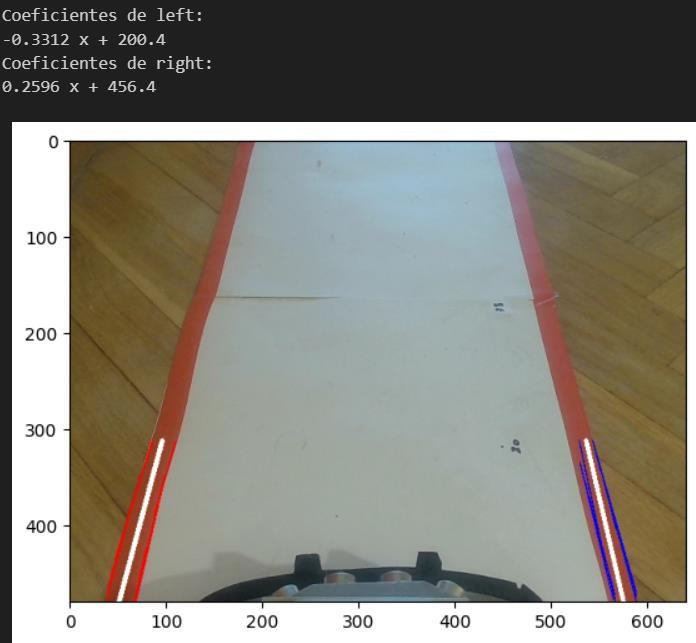
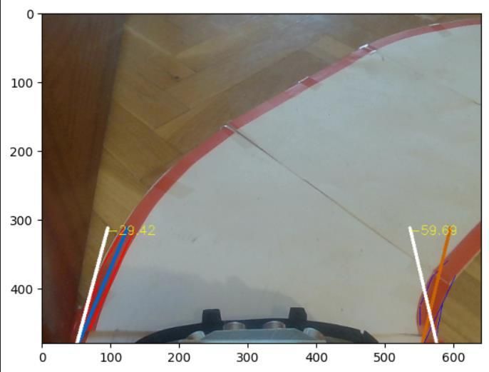

# Detección de Carril: Pipeline de Visión Artificial

[← Volver al TFG2](README.md)

## Visión General

La detección de carril se implementa en la clase `ImageProcessor` (ubicada en `src/robocar_pkg/lib/`), que procesa cada frame de la cámara para identificar los bordes del carril y calcular la posición del robot respecto a ellos.

## Pipeline de Procesamiento

```
Frame (640×480 BGR)
    │
    ▼
1. Conversión HSV + Filtro de color rojo
    │
    ▼
2. Umbralización → Frame binario
    │
    ▼
3. Gaussian Blur (reducción de ruido)
    │
    ▼
4. Detección de bordes (Canny)
    │
    ▼
5. Selección de Región de Interés (ROI)
    │
    ▼
6. Transformada de Hough → Líneas candidatas
    │
    ▼
7. Filtrado de líneas → Carril izquierdo / derecho
    │
    ▼
8. Filtro de Kalman → Estimación suavizada
    │
    ▼
9. Cálculo de error (offset) → PID → Ángulo de giro
```

## Clase ImageProcessor

### Métodos principales

| Método | Función |
|---|---|
| `process(frame)` | Método principal. Ejecuta todo el pipeline y almacena los carriles en `self.left` y `self.right` |
| `get_line_markings(frame)` | Aísla los carriles del frame. Devuelve frame binario con las líneas detectadas |
| `doBlur(frame, iterations, kernelSize)` | Aplica filtro Gaussian Blur |
| `doRegionOfInterest(frame)` | Aplica máscara con la ROI definida por `self.roiX` y `self.roiY` |
| `findLanes(frame, lines, drawAll)` | Itera sobre líneas de Hough y filtra para separar carril izquierdo/derecho |
| `drawPoly(frame, poly, color, width)` | Dibuja una línea definida por un polinomio sobre el frame |

### Atributos clave

- `self.roiX`, `self.roiY` — Porcentaje de la imagen seleccionado como ROI
- `self.left`, `self.right` — Polinomios que representan los carriles detectados
- `self.averageLeft`, `self.averageRight` — Carriles de referencia (centrados)

## Etapas del Pipeline en Detalle

### 1. Conversión a Frame Binario

**Conversión HSV:** Se convierte el frame BGR a HSV para filtrar por color.

**Filtro de color rojo:** Se aplica un rango HSV calibrado para aislar las líneas rojas del carril. El script de calibración está en `pruebas/computer_vision/calibration/hsv_calibration.py` y permite ajustar los rangos con un panel de control interactivo.

**Umbralización:** Se descarta todo lo que no sea del color rojo filtrado, obteniendo un frame binario (blanco = carril, negro = fondo).



### 2. Detección de Bordes (Canny)

1. **Gaussian Blur:** Se suaviza la imagen binaria para reducir ruido
2. **Algoritmo Canny:** Detecta bordes calculando el gradiente de intensidad. Produce una imagen donde los bordes del carril son claramente visibles



### 3. Región de Interés (ROI)

Se aplica una máscara que limita el análisis a la zona inferior-central del frame, donde se esperan los carriles. La ROI tiene forma trapezoidal:
- Base ancha en la parte inferior (cerca del robot)
- Se estrecha hacia arriba (perspectiva de la carretera)

Los parámetros `self.roiX` y `self.roiY` definen el tamaño como porcentaje del frame.



### 4. Transformada de Hough

Se utiliza `cv2.HoughLinesP` (versión probabilística) para detectar líneas en la imagen de bordes:
- Cada línea se representa por sus puntos de inicio y fin `(x1, y1, x2, y2)`
- Se obtienen múltiples líneas candidatas que luego se filtran

**Principio:** La transformada de Hough convierte el problema de detección de líneas del espacio de píxeles al espacio de parámetros (ρ, θ), donde las intersecciones de curvas sinusoidales indican líneas en la imagen original.

### 5. Filtrado de Líneas por Escenario

| Escenario | Algoritmo de filtrado |
|---|---|
| **Dos líneas detectadas** | El extremo más cercano al robot determina el carril: si está en el cuadrante izquierdo → carril izquierdo, y viceversa |
| **Una línea detectada** | La pendiente indica el carril: pendiente negativa → derecho, pendiente positiva → izquierdo |
| **Ninguna línea** | Se usa la estimación del filtro de Kalman basada en frames anteriores |

### 6. Carriles de Referencia (Centrado)

Se obtiene un frame donde el robot está perfectamente centrado y los carriles son rectos. Las líneas detectadas en este frame se guardan como referencia:
- `averageLeft` — Recta del carril izquierdo centrado
- `averageRight` — Recta del carril derecho centrado

Estos valores de referencia son fundamentales para el cálculo del error.



### 7. Cálculo del Error (Offset)

El error se calcula como la diferencia entre los carriles de referencia (centrado perfecto) y los carriles detectados en el frame actual, medida en el punto más alto de la ROI:

```
left_error  = averageLeft(y0) - left(y0)
right_error = averageRight(y0) - right(y0)
```

Donde `y0` es la coordenada Y del tope de la ROI.

El error promedio `(left_error + right_error) / 2` indica cuánto se ha desviado el robot del centro del carril.



## Resumen del Algoritmo (Pseudocódigo)

```python
# Inicialización
left_tracker  = Tracker()    # Kalman para carril izquierdo
right_tracker = Tracker()    # Kalman para carril derecho
average_left  = getAverageLeft()
average_right = getAverageRight()

# Para cada frame:
binary_frame = filtrar_imagen_color(frame)
canny = bordes_canny(binary_frame)
lines = transformada_hough(canny)
left, right = filtrado_lineas(lines)

# Estimación con Kalman
kalman_left  = left_tracker.add(left)
kalman_right = right_tracker.add(right)

if not exists(left):
    left = kalman_left      # Usar estimación si no hay detección
if not exists(right):
    right = kalman_right

# Cálculo del error
y0 = getTopROI()
left_error  = average_left(y0)  - left(y0)
right_error = average_right(y0) - right(y0)
```

## Herramienta de Desarrollo

La implementación se desarrolló y probó inicialmente en un **Jupyter Notebook** (`pruebas/computer_vision/video.ipynb`), que permite visualizar cada etapa del pipeline de forma interactiva antes de integrar el código en los nodos de ROS2.

Las pruebas se realizan grabando frames de ejemplo mientras se conduce manualmente por el circuito (`pruebas/computer_vision/log/frame_x.jpg`).


