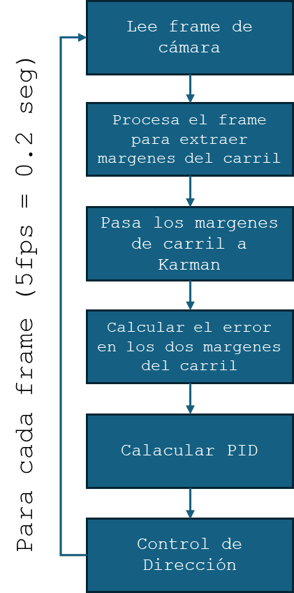
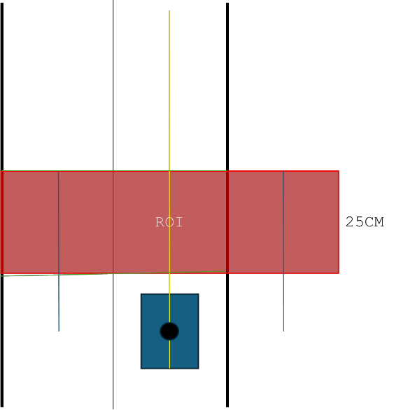
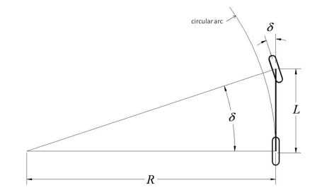
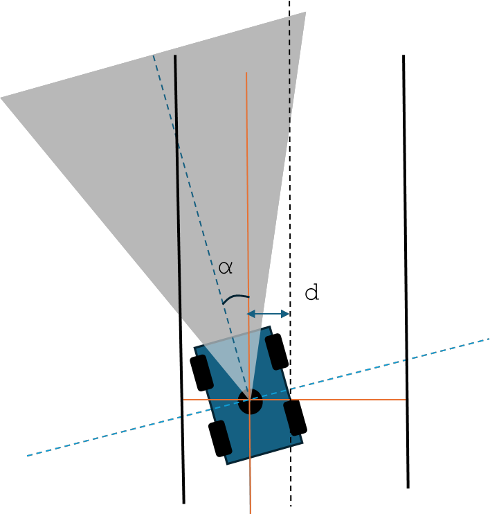
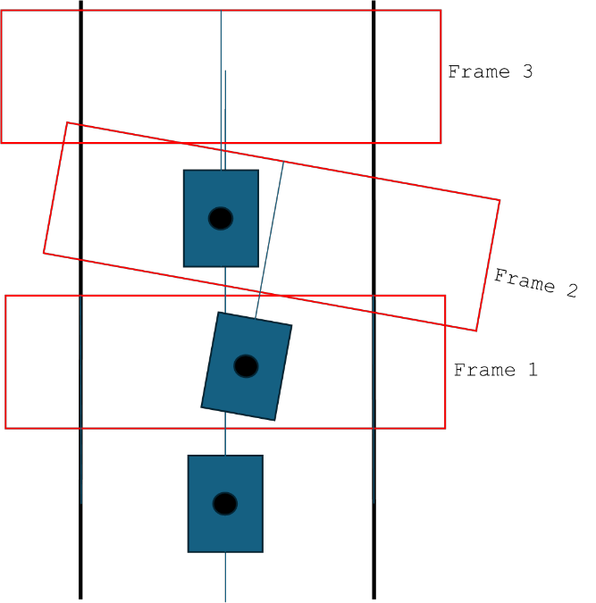

# Modelo del Sistema: Robot y Entorno

[← Volver al TFG2](README.md)

## Visión General

Este modelo adapta las tecnologías de detección y seguimiento de carril a la realidad física del robot y su entorno. Define los parámetros del carril, la cámara, la cinemática del robot y las condiciones operativas para que el bucle de control funcione eficientemente.



## Modelo del Carril

### Características

| Parámetro | Valor |
|---|---|
| Delimitación | Línea roja |
| Anchura | 27 cm (suficiente para las dimensiones del robot) |
| Radio de curvatura mínimo | 20 cm |
| Modelo geométrico | **Lineal** (válido para campo cercano a baja velocidad) |

### Restricciones y asunciones

- El carril es de **ancho constante**
- No hay curvas demasiado pronunciadas (limitado por ángulo de giro máximo de 30°)
- La ROI corta permite representar los bordes del carril como **rectas**, simplificando el análisis

## Datos del Robot

| Parámetro | Valor |
|---|---|
| Distancia entre ejes (L) | 17.5 cm |
| Anchura (D) | 14 cm |
| Diámetro de ruedas (r) | 6.5 cm |
| Ángulo máximo de giro (θ) | ±30° (dirección tipo Ackermann) |
| Velocidad operativa | 18 cm/s (constante en modo autónomo) |

## Velocidad y Región de Interés (ROI)

### Cálculos derivados de la velocidad

El control de dirección se realiza **una vez por frame**. Entre frames no hay corrección, por lo que la distancia recorrida debe ser suficientemente corta para que el robot no se salga del carril.

| Parámetro | Cálculo | Valor |
|---|---|---|
| Velocidad | v | 0.18 m/s |
| Frames por segundo | FPS | 5 FPS |
| Tiempo sin control | 1/FPS | 0.20 s |
| Distancia sin control | v/FPS | **3.6 cm** |

> Cada 3.6 cm el robot puede rectificar la dirección. Valores adecuados para el sistema.

### ROI definida

| Parámetro | Valor |
|---|---|
| Longitud ROI | 25 cm |
| Tiempo para dejar atrás la ROI | 1.4 s |



La ROI corta implica que los bordes del carril dentro de ella pueden modelarse como rectas, lo que simplifica enormemente el procesamiento.

## Modelo Geométrico del Robot

### Modelo de bicicleta (simplificación de Ackermann)

Se utiliza el **modelo de bicicleta**, una simplificación común para dirección Ackermann:
- Las dos ruedas delanteras se combinan en una sola
- Las dos ruedas traseras se combinan en una sola
- El vehículo solo se mueve en un plano

**Relación geométrica:**

```
tan(δ) = L / R
```

Donde:
- `δ` — Ángulo de dirección
- `L` — Distancia entre ejes (17.5 cm)
- `R` — Radio de curvatura resultante

**Valores derivados:**

| Parámetro | Fórmula | Valor |
|---|---|---|
| R mínimo | L / tan(θ_max) | 17.5 cm |
| R máximo | | ∞ (recto) |



## La Cámara y Medición de Distancias

### Calibración

La calibración de la cámara tiene influencia extrema en el resultado. Los parámetros relevantes incluyen:
- **Posición** y **ángulo de visión** en el robot
- **Parámetros intrínsecos:** Centro de imagen, longitud focal, factores de escala, distorsión del lente

Con una cámara correctamente calibrada, se pueden **medir distancias en la imagen** basándose en el número de píxeles, conociendo la geometría del sistema.

### Cámara utilizada

**NexiGo USB Webcam** — Full HD 1080p @ 60fps, resolución de trabajo: 640×480 píxeles (suficiente para detección de líneas). Formato de frames: **BGR8**.

## Posición Respecto al Carril

### Parámetros de posición

Dos variables definen la posición del robot respecto al carril:

1. **d** — Desplazamiento lateral respecto al centro del carril
2. **α** — Ángulo del robot respecto a los bordes del carril

| Condición | Acción |
|---|---|
| d < 0 y α < 0 | Girar a la derecha |
| d > 0 y α > 0 | Girar a la izquierda |
| d y α con signos opuestos | Caso ambiguo |
| d = 0 y α = 0 | Posición óptima |

### Cálculo simplificado del error

Para este proyecto, se simplifica el cálculo aprovechando la baja velocidad y el enfoque en campo cercano:

- Se miden los desplazamientos **d1** y **d2** respecto a los límites del carril **al final de la ROI**
- El error se calcula como la diferencia entre la posición detectada y la posición de referencia (centrado perfecto)

Esta simplificación evita cálculos complejos de puntos de fuga y es suficiente para el escenario operativo del robot.



## Análisis de Trayectoria

### Correcciones entre frames

Aplicando el modelo geométrico, se calculan las correcciones máximas entre dos frames consecutivos:

| Parámetro | Fórmula | Valor máximo |
|---|---|---|
| Distancia entre frames (l) | v / FPS | 3.6 cm |
| Corrección angular (α) | l / R | 0.07π ≈ **8°** por frame |
| Corrección angular en 1s | α × FPS | ~**45°/s** |
| Desplazamiento lateral (d) | R(1 - cos(l/R)) | **0.37 cm** por frame |
| Desplazamiento en 1s | d × FPS | ~**1.8 cm/s** |



### Interpretación

- En ~1 segundo, el robot puede corregir hasta **45°** de desviación angular
- En ~1 segundo, puede desplazarse lateralmente hasta **1.8 cm**
- Estos valores son suficientes para las condiciones operativas definidas (carril de 27 cm, curvas suaves)
