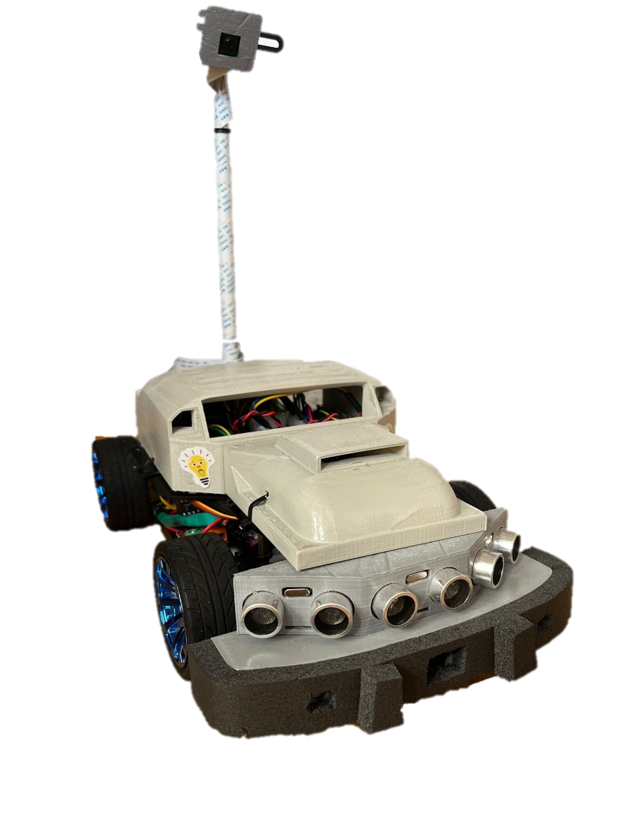
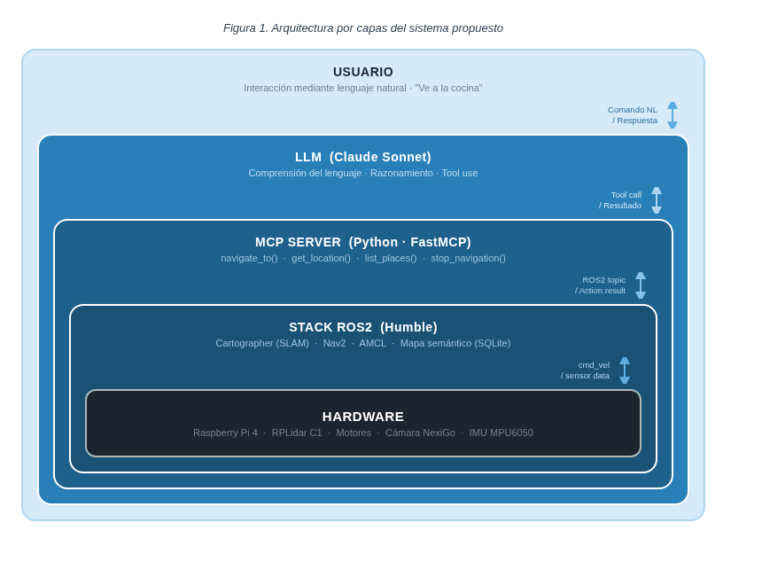

# TFM: Integración de LLMs en Sistemas de Navegación Autónoma de Robocar

> **Trabajo Fin de Máster** — Máster en Inteligencia Artificial, Universidad Internacional de La Rioja  
> **Autor:** Rubén Higuera Castillo  
> **Director:** Óscar Sánchez Rueda  
> **Fecha:** Abril 2026  
> **Estado:** En desarrollo 🚧  
> 📄 [Memoria original (PDF)](TFM_entrega_1.pdf)

## Introducción

Este TFM amplía la evolución de **Robocar** iniciada en el [TFG 1](../tfg1-construccion/README.md) y continuada en el [TFG 2](../tfg2-lane-following/README.md). Mientras que el trabajo anterior permitió al robot seguir carriles de forma reactiva mediante visión artificial, el sistema seguía teniendo una limitación estructural: **carece de consciencia espacial global**, no puede planificar rutas hacia destinos semánticos y requiere conocimientos de ROS2 para interactuar con él.

La propuesta de este TFM transforma Robocar en una plataforma de **navegación autónoma orientada a objetivos**, capaz de recibir instrucciones en lenguaje natural y convertirlas en acciones de navegación sobre un mapa del entorno.

### Arquitectura propuesta

La solución se articula en tres capas software claramente desacopladas:

| Capa | Tecnologías | Función principal |
|---|---|---|
| **Percepción** | Cartographer + RPLidar C1 | Construcción del mapa 2D, localización del robot y representación espacial del entorno |
| **Navegación** | Nav2 | Planificación de rutas, seguimiento de trayectorias y evitación de obstáculos |
| **Interfaz natural** | LLM + MCP | Traducción de instrucciones en lenguaje natural a acciones robóticas seguras y observables |

Este enfoque permite pasar de un comportamiento puramente reactivo a un sistema capaz de responder a órdenes del tipo *"ve al laboratorio"*, *"detén la navegación"* o *"qué lugares conoces"* sin exponer al usuario final a la complejidad interna de ROS2.

## Objetivos

**Objetivo general:** diseñar e implementar una arquitectura software que integre **SLAM**, **planificación de rutas** y **LLMs** para habilitar navegación autónoma orientada a objetivos en interiores mediante comandos en lenguaje natural.

### Objetivos específicos

| Objetivo | Descripción | Criterio de validación |
|---|---|---|
| **OE1** | Implementar SLAM 2D con **Cartographer** y **RPLidar C1**, incorporando un mapa semántico persistente | Error de localización < 10 cm y al menos 3 lugares etiquetados en SQLite |
| **OE2** | Integrar la pila **Nav2** para navegación punto a punto entre ubicaciones conocidas | Tasa de éxito > 90% entre waypoints semánticos |
| **OE3** | Desarrollar un **MCP Server** en Python/FastMCP conectado con ROS2 | Herramientas operativas: `navigate_to()`, `get_current_location()`, `list_known_places()`, `stop_navigation()` |
| **OE4** | Validar el pipeline completo desde lenguaje natural hasta ejecución robótica | Tasa de interpretación correcta > 85% en una batería con órdenes simples, secuencias compuestas y casos de error |

## Metodología

Se adopta una **metodología incremental en espiral**, dividida en cinco fases secuenciales con hitos de validación explícitos. Cada fase produce un entregable funcional antes de avanzar a la siguiente, reduciendo el riesgo de integración tardía entre percepción, navegación y capa conversacional.

| Fase | Duración estimada | Alcance | Puerta de validación |
|---|---|---|---|
| **Fase 1: SLAM y mapa semántico** | 3-4 semanas | Integración del RPLidar C1, SLAM con Cartographer y base de datos de lugares | Mapa 2D estable, localización reproducible y lugares persistidos |
| **Fase 2: Navegación con Nav2** | 3-4 semanas | Configuración de Nav2, resolución semántica de destinos y navegación punto a punto | Navegación autónoma fiable entre ubicaciones conocidas |
| **Fase 3: MCP Server** | 2-3 semanas | Implementación del servidor FastMCP y de las 4 herramientas de control | Herramientas accesibles y conectadas con `rclpy` |
| **Fase 4: Integración con LLM** | 2-3 semanas | Conexión con Claude API, prompt de sistema y host conversacional | Ejecución correcta de órdenes simples y compuestas |
| **Fase 5: Pruebas y evaluación** | 2-3 semanas | Batería de ensayos extremo a extremo con órdenes simples, secuencias compuestas y casos de error, toma de métricas y cierre documental | Resultados medidos frente a los objetivos OE1-OE4 |

## Métricas de éxito

| Métrica | Objetivo | Umbral |
|---|---|---|
| Error de localización (OE1) | RMSE posición AMCL vs real | < 10 cm |
| Tasa de éxito navegación (OE2) | % navegaciones exitosas (≥20 ensayos) | > 90% |
| Tasa interpretación correcta (OE4) | % comandos NL → herramientas correctas (≥20 comandos) | > 85% |
| Latencia de respuesta (OE3-OE4) | Tiempo comando → inicio movimiento (10 ensayos) | Mediana < 5 s |

## Documentación técnica

| Documento | Contenido |
|---|---|
| [Capa de percepción: SLAM](slam.md) | SLAM con Cartographer y RPLidar C1 |
| [Capa de navegación: Nav2](navegacion.md) | Planificación y navegación *goal-directed* |
| [Capa de interfaz: LLM + MCP](llm-mcp.md) | Interfaz de lenguaje natural con Model Context Protocol |

## Relación con trabajos anteriores

- [TFG 1: Diseño y Construcción de Robocar](../tfg1-construccion/README.md) — Construcción del robot, electrónica, sensores y arquitectura base
- [TFG 2: Seguimiento de Carril](../tfg2-lane-following/README.md) — Percepción visual, seguimiento reactivo de carril y control PID

## Estado actual

**En desarrollo — Entrega 1 completada (capítulos 1-3).**

La primera entrega define el problema, justifica la transición desde navegación reactiva a navegación orientada a objetivos y establece la arquitectura técnica sobre la que se implementará la integración entre **SLAM**, **Nav2** y **LLMs**.
