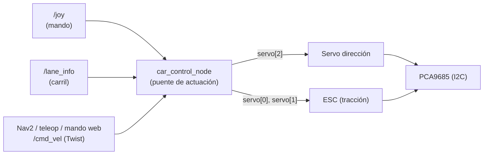
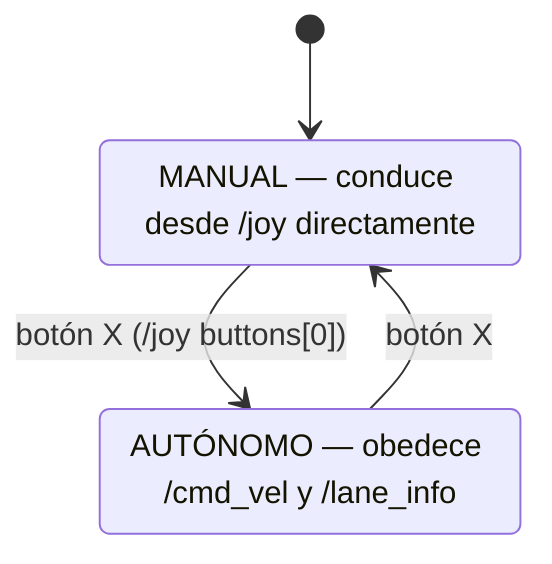
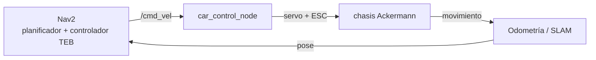

# Actuación: el puente `/cmd_vel` (car_control_node)

[← Volver al TFM](README.md)

`car_control_node` es el **único actuador** del robocar: el nodo que convierte una orden de
movimiento genérica en señales físicas al **servo de dirección** y al **ESC de tracción** (vía
PCA9685). Es la última pieza de la cadena de control y, por eso, la que concentra la **lógica de
seguridad** del vehículo. Los fundamentos conceptuales del puente están en
[Fundamentos ROS2 §4](fundamentos.md); este documento describe la **implementación real** y sus
salvaguardas.

!!! abstract "Resumen"
    Traduce `/cmd_vel` (`geometry_msgs/Twist`) a **ángulo de servo** (dirección Ackermann) +
    **throttle del ESC**, con **rampa anti-pico**, **watchdog**, **tope duro del 50 %**, **armado
    del ESC** y **neutro garantizado** al arrancar, al perder comandos y al salir. En la navegación
    autónoma es el eslabón **Nav2 → `/cmd_vel` → car_control → motores**.

## 1. Lugar en la arquitectura



| | |
|---|---|
| **Suscribe** | `/cmd_vel` (`Twist`) · `/joy` (`Joy`) · `/lane_info` (`Float32MultiArray`) |
| **Actúa sobre** | PCA9685 por I2C: `servo[2]` = dirección · `servo[0]`+`servo[1]` = ESC (dos canales) |
| **No publica topics**: | su salida es hardware (I2C), no ROS |

## 2. El mapeo Ackermann

### Dirección (`angular.z` → servo canal 2)

```text
steer = steer_center + (angular.z / max_angular) · steer_span
```

Centrado en **105°**, desviación máxima **±65°**, recortado al rango físico del servo **[40, 170]**.
Convención: `angular.z > 0` (giro a la izquierda) → servo por encima del centro.

### Tracción (`linear.x` → throttle del ESC, canales 0 y 1)

El ESC (BLHeli bidireccional) tiene su **neutro en 93.6** y **avanza BAJANDO el ángulo** (93.6
reposo → 27 a fondo). El mapeo:

```text
linear.x <= 0      → throttle = 93.6 (neutro)   ← sin marcha atrás en esta ruta
linear.x  > 0      → throttle = start − frac·(start − full),  frac = min(vx / max_lin, 1)
```

con `throttle_start = 90.0` (donde empieza a moverse) y `throttle_full = 78.0` (a `max_linear`,
conservador). Después se recorta al rango **[59.4, 93.6]**.

!!! danger "Regla dura: tope del 50 % (`THROTTLE_HARD_FLOOR = 59.4`)"
    El throttle **nunca** baja de 59.4 (el 50 % del recorrido 93.6→27). Es un límite **de código,
    innegociable**: ningún parámetro puede saltárselo. Protege el hardware y a las personas de
    acelerones a fondo.

## 3. Las salvaguardas (por qué este nodo es "de seguridad")

| Mecanismo | Qué hace |
|---|---|
| **Armado del ESC** | Al arrancar pone throttle a neutro (93.6). El ESC solo se arma si ve señal estable en su neutro al encender; por eso el nodo emite neutro antes de aceptar comandos. |
| **Watchdog** | Un timer a 10 Hz: si no llega `/cmd_vel` durante `cmd_vel_timeout` (0.5 s), pone el throttle a **neutro**. Evita que el coche siga latcheado si el emisor muere. |
| **Tope duro 50 %** | `clamp` a `THROTTLE_HARD_FLOOR` (59.4). |
| **Rampa anti-pico** | **Dar** gas (bajar el ángulo) se limita a `max_throttle_step` (0.5°/comando); **quitar** gas (subir) es instantáneo. Suaviza arranques (menos patinaje) y frena sin demora. |
| **I2C con reintentos** | Cada escritura de throttle reintenta 3× por canal; un fallo se **registra** (no se silencia), y si no se puede poner neutro se emite `FATAL`. El arranque del motor mete ruido en el bus. |
| **Neutro al salir** | Un `finally` pone el throttle a reposo al terminar el nodo; si falla, avisa. |

!!! warning "Regla de oro (Rubén)"
    **Nunca reiniciar el software con el ESC armado**: el `init` de `ServoKit` resetea el PCA9685 y
    glitchea la señal. Secuencia segura de arranque: coche ON → nodo emitiendo neutro → el ESC se
    arma solo.

## 4. Modos: manual y autónomo



- **Manual** (por defecto): `manual_control()` lee el `/joy` — dirección con `axes[0]`, gas con el
  gatillo **R2** (`axes[5]`), marcha atrás con **L1** (`buttons[4]`). Escribe el throttle
  **directamente**.
- **Autónomo**: actúan `cmd_vel_callback` (Nav2/teleop/mando web) y `lane_info_callback`
  (seguimiento de carril). El toggle es el botón **X** (`buttons[0]`).

!!! note "Diferencia de seguridad entre modos"
    La ruta **`/cmd_vel` (autónoma)** tiene **rampa + watchdog + tope**. La ruta **manual escribe el
    throttle directo, sin watchdog ni rampa**: si dejan de llegar mensajes de `/joy`, el throttle
    queda **latcheado**. Detalle relevante para el [mando web](conceptos.md) y para depurar: un
    `/joy` con los gatillos a 0 (en vez de su reposo +1.0) se lee como medio gas.

## 5. Parámetros (calibrables en caliente)

Ajustables con `ros2 param set /car_control_node <param> <valor>`:

| Parámetro | Valor | Significado |
|---|---|---|
| `max_linear` | 0.7 | m/s de entrada que corresponde a `throttle_full` |
| `max_angular` | 0.4 | rad/s de entrada que corresponde al tope de dirección |
| `throttle_stop` | 93.6 | **neutro** (para y arma el ESC) |
| `throttle_start` | 90.0 | umbral donde el coche empieza a moverse |
| `throttle_full` | 78.0 | throttle a `max_linear` (conservador) |
| `steer_center` | 105.0 | servo de dirección centrado |
| `steer_span` | 65.0 | desviación máxima de dirección (grados) |
| `cmd_vel_timeout` | 0.5 | s sin `/cmd_vel` → neutro (watchdog) |
| `max_throttle_step` | 0.5 | °/comando al dar gas (rampa) |

## 6. Papel en la navegación autónoma

En la [Capa 2 (Navegación)](navegacion.md), la cadena de actuación será:



Nav2 emite un `Twist` genérico; `car_control` lo convierte en la cinemática real del coche
respetando sus límites. **Su fiabilidad (rampa, watchdog, tope, armado) es lo que permite que Nav2
mueva el chasis de forma segura.** El controlador local elegido es **TEB** (decisión D3), por
respetar el radio de giro Ackermann.

## 7. Limitaciones conocidas

- **Sin marcha atrás por `/cmd_vel`**: `linear.x ≤ 0` → neutro. La reversa solo existe en modo
  manual (L1). Añadirla requeriría mapear `linear.x < 0` a throttle de reversa del ESC.
- **La ruta manual no tiene watchdog ni rampa** (escritura directa).
- El `lane_info_callback` mantiene el motor en neutro (93.6) — el gas del seguimiento de carril está
  desactivado a la espera de calibrar.
