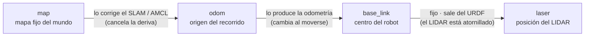

# Fundamentos ROS2: TF, odometría y cinemática Ackermann

[← Volver al TFM](README.md)

Antes de que la [capa de percepción (SLAM)](slam.md) y la [capa de navegación (Nav2)](navegacion.md)
puedan siquiera arrancar, el robot debe resolver una serie de fundamentos que ni Cartographer ni
Nav2 proporcionan por sí mismos. En el [roadmap de implementación](roadmap.md) esta base se
denomina **Capa 0**, y es la que concentra el mayor riesgo técnico del proyecto.

!!! warning "Por qué existe esta capa"
    Cartographer y Nav2 **no son sistemas de "enchufar y funcionar"**. Son librerías que asumen
    que el robot ya sabe responder a tres preguntas. La memoria comienza directamente en
    *"configuro Cartographer"* y *"configuro Nav2"*, pero esos cimientos no existen todavía en la
    plataforma y hay que construirlos explícitamente.

| Pregunta que asume el stack | Componente que la responde |
|---|---|
| ¿Qué forma tengo y dónde está cada sensor? | **URDF + árbol TF** |
| ¿Cuánto y cómo me he movido? | **Odometría** |
| ¿Cómo convierto una orden de movimiento en girar ruedas? | **Puente `/cmd_vel`** (cinemática **Ackermann**) |

## 1. Cinemática Ackermann

**Ackermann** es el nombre técnico de la dirección **tipo coche**: se gira mediante un servo que
orienta las ruedas delanteras, mientras la tracción es independiente. Robocar es así (servo de
dirección + ESC de tracción, ambos gobernados por el PCA9685).

El problema práctico es que **la gran mayoría de tutoriales y ejemplos de ROS2/Nav2 asumen un
robot diferencial**, que es un modelo cinemático distinto:

| | Diferencial (TurtleBot, robot aspirador) | Ackermann (Robocar, un coche) |
|---|---|---|
| Cómo gira | Ruedas izq./der. a distinta velocidad | Servo que orienta las ruedas delanteras |
| ¿Puede girar sobre sí mismo? | **Sí** (radio de giro = 0) | **No**: necesita avanzar para girar |
| Rotar en el sitio / moverse de lado | Puede rotar en el sitio | Imposible |

### Consecuencias para el TFM

La cinemática Ackermann afecta a dos puntos concretos de Nav2:

- **Controlador local.** El controlador por defecto (**DWB**) asume que el robot puede rotar en
  el sitio. Aplicado a un coche, planificaría maniobras físicamente imposibles (p. ej. *"gira 90°
  sin avanzar"*). Por eso se recomienda **TEB** (*Timed Elastic Band*), que respeta el radio de
  giro mínimo. La propia memoria ya lo apunta: *"una alternativa muy usada en plataformas
  ackermann es TEB"*.
- **Puente de actuación.** Nav2 no conoce el servo del robot: emite un mensaje genérico
  `/cmd_vel` (`geometry_msgs/Twist`) del tipo *"avanza a 0.3 m/s girando a 0.2 rad/s"*. Hace falta
  un nodo que **traduzca ese `Twist` a ángulo de servo + throttle del ESC**, respetando los
  límites cinemáticos del vehículo. Ese traductor todavía no existe.

## 2. URDF y árbol TF

### URDF — el "plano" del robot

**URDF** (*Unified Robot Description Format*) es un archivo XML que declara **de qué piezas está
hecho el robot y dónde está físicamente cada una**: por ejemplo, *"el LIDAR está montado 10 cm por
encima y 5 cm por delante del centro del robot"*.

Es el equivalente al plano de montaje. Cartographer necesita saber exactamente dónde está el LIDAR
respecto al centro del coche, porque el sensor mide distancias **desde su propia posición** y todas
esas medidas hay que referirlas a un origen común.

### TF (tf2) — el sistema de coordenadas vivo

**TF (tf2)** mantiene, **en cada instante**, las relaciones espaciales entre todas las piezas del
robot y el mundo. Es un árbol de marcos de referencia (*frames*):



Cada flecha es una transformación (*cómo paso de un marco al siguiente*), y lo esencial es que
**cambian continuamente mientras el robot se mueve**:

| Transformación | ¿Cambia? | ¿Quién la produce? |
|---|---|---|
| `laser → base_link` | **Fija** | El **URDF** (el LIDAR está atornillado) |
| `odom → base_link` | Cambia todo el rato | La **odometría** (cuánto se ha movido) |
| `map → odom` | Se corrige al detectar deriva | **Cartographer / AMCL** |

!!! info "Por qué es imprescindible"
    Cuando el LIDAR ve una pared *"a 2 m a mi derecha"*, ROS2 usa el árbol TF para calcular *"esa
    pared está en la coordenada (X, Y) del mapa"*. Sin TF, un escaneo del LIDAR es solo un montón
    de números sin ubicación en el mundo. **Cartographer y Nav2 no arrancan si el árbol TF no está
    completo y es coherente.**

## 3. Odometría

La **odometría** es la pieza que produce la transformación `odom → base_link`, es decir, la
estimación de **cuánto se ha movido el robot**.

En un robot diferencial es sencilla: se cuentan las vueltas de la rueda izquierda y derecha y se
deduce el desplazamiento. En un **coche Ackermann es más difícil**, porque hay que combinar la
velocidad de las ruedas **con el ángulo del servo de dirección**, y los encoders ópticos disponibles
dan una señal más pobre.

De ahí la **decisión de diseño D2** del roadmap:

| Opción | Enfoque | Compromiso |
|---|---|---|
| **A** | Pose por *scan-matching* de Cartographer (sin odometría de ruedas fiable) | Rápido de desbloquear, menos preciso |
| **B** | Fusión encoders + IMU con `robot_localization` (EKF) + AMCL | Más robusto, más trabajo; **no está en la memoria** |

## 4. El puente `/cmd_vel`: del Twist a los servos

Nav2 y la teleoperación no conocen el servo ni el ESC del robot: hablan un idioma genérico y
estándar, el topic **`/cmd_vel`**. El **puente** es el nodo que traduce ese comando genérico a los
ángulos de servo concretos del PCA9685. En Robocar se implementa **ampliando `car_control_node`**
(hito 0.2 del roadmap), y no como un nodo aparte, para que siga siendo el **único dueño del bus
I2C** (dos nodos escribiendo el PCA9685 se pisarían).

### El mensaje `Twist`

`/cmd_vel` es de tipo `geometry_msgs/Twist`: dos vectores de velocidad (lineal y angular). Para un
coche que se mueve en el plano solo dos componentes son útiles:

| Campo | Significado | Unidad | Uso en Robocar |
|---|---|---|---|
| `linear.x` | Velocidad de avance/retroceso | m/s | → throttle del ESC (canales 0 y 1) |
| `angular.z` | Velocidad de giro (yaw rate) | rad/s | → servo de dirección (canal 2) |
| `linear.y`, `linear.z`, `angular.x`, `angular.y` | Movimientos que un coche no puede hacer | — | Ignorados |

!!! warning "Son velocidades, no posiciones"
    `linear.x` no es *"avanza 2 m"* sino *"ve a 0.3 m/s"*; y `angular.z` **no es un ángulo de
    volante**, sino una **velocidad de giro** (rad/s).

### `angular.z` y el acoplamiento Ackermann

Aquí reaparece la [cinemática Ackermann](#1-cinematica-ackermann). En un robot diferencial,
`angular.z` se traduce fácil (una rueda más rápida que la otra, incluso parado). En un coche, en
cambio, **solo se gira si se avanza**, y el ángulo de volante necesario depende también de la
velocidad, según el modelo de bicicleta:

```text
angular.z = linear.x · tan(δ) / L
   (giro)    (avance)  (volante)  (batalla = distancia entre ejes)
```

Es decir: **el mismo ángulo de volante produce distinto giro real según la velocidad.** Por eso
convertir `angular.z` en "cuánto torcer el servo" no es directo en un coche: en rigor hace falta
`linear.x` también.

### Cómo lo interpreta el código (hito 0.2)

La implementación actual usa una **simplificación deliberada**: mapea `angular.z` directamente al
ángulo de servo, de forma **lineal y proporcional**, sin usar `linear.x`.

```python
# DIRECCIÓN: angular.z -> ángulo de servo (canal 2)
steer = steer_center + (angular_z / max_angular) * steer_span   # 105 + (ang/0.4)*65
steer = clamp(steer, 40.0, 170.0)

# TRACCIÓN: linear.x -> throttle del ESC (canales 0 y 1)
# Calibrado empírico: el ESC avanza BAJANDO el ángulo (reposo 91.8 → a fondo 27);
# el movimiento arranca en ~90. lin<=0 → reposo (sin marcha atrás por ahora).
throttle = throttle_start - (linear_x / max_linear) * (throttle_start - throttle_full)
throttle = clamp(throttle, THROTTLE_HARD_FLOOR, throttle_stop)  # regla dura: ≤50% de gas (59.4°)
```

Todos los valores (`max_angular`, `steer_center`, `steer_span`, `throttle_neutral`, `span`…) son
**parámetros ROS**, ajustables en caliente con `ros2 param set` sin recompilar.

!!! note "Por qué la simplificación es suficiente ahora"
    Con el mando, **el humano cierra el bucle**: si el coche gira poco, mueve más el stick. La
    imprecisión de ignorar la velocidad no molesta. Sirve para validar el puente y conducir.

!!! danger "Armado del ESC y regla de oro operativa (aprendida por las malas)"
    El ESC BLHeli bidireccional **solo se arma si ve señal PWM estable en su neutro real
    (93.6° ≈ 1530 µs)** — es el valor que el mando emitía en reposo a 20 Hz. Además,
    **inicializar el PCA9685** (arrancar un nodo o script con `ServoKit`) **resetea el chip y
    glitchea la señal**: con un ESC armado eso puede disparar los motores. De ahí la regla:

    1. Encender el coche → 2. levantar **un único** nodo de control emitiendo neutro →
    3. el ESC se arma solo (pitidos) → 4. probar (rampa, nunca escalones) →
    5. **apagar el coche entero antes de reiniciar software de control.**

    Validado en la sesión de caracterización (jul 2026): movimiento proporcional, parada
    desde movimiento por watchdog y cero incidencias eléctricas usando rampas de 1.5°/s.

!!! tip "La versión correcta llega con Nav2"
    Para navegación autónoma (Capa 2) se hará la conversión Ackermann fiel, despejando el ángulo de
    volante de la fórmula con **ambos** valores:

    ```text
    δ = atan( L · angular.z / linear.x )
    ```

    Y se usará el controlador **TEB**, que ya respeta la cinemática de un coche (no pide giros sin
    avance). Es la [Decisión D3](roadmap.md#3-decisiones-de-diseno) del roadmap.

## 5. Por qué la Capa 0 es el riesgo principal

!!! danger "Dónde se atascan los TFM de robótica"
    Las capas más vistosas del TFM —el **LLM** y el **MCP**— son en realidad **las más fáciles y
    acotadas**: son APIs bien documentadas, código Python de sobremesa, sin física de por medio.

Lo que hunde los cronogramas de los proyectos de robótica es precisamente esta Capa 0: conseguir un
**TF coherente**, una **odometría que no derive**, y que la salida de Nav2 **mueva de verdad un
chasis Ackermann**. Es trabajo poco vistoso ("fontanería"), muy dependiente del hardware real y
difícil de depurar.

Por eso el orden recomendado es **empezar por aquí**:

- Si la Capa 0 está sólida, el resto (mapa → Nav2 → MCP → LLM) avanza con fluidez.
- Si no lo está, el proyecto se queda **sin mapa y sin poder progresar a ninguna otra capa**, ya
  que la dependencia es estrictamente secuencial.

!!! note "Relación con el resto del proyecto"
    Esta capa alimenta directamente a la [capa de percepción (SLAM)](slam.md) —que necesita TF y,
    opcionalmente, odometría— y a la [capa de navegación (Nav2)](navegacion.md) —que necesita TF,
    odometría y el puente `/cmd_vel`. Su planificación detallada está en el
    [roadmap de implementación](roadmap.md) como **Capa 0**.
