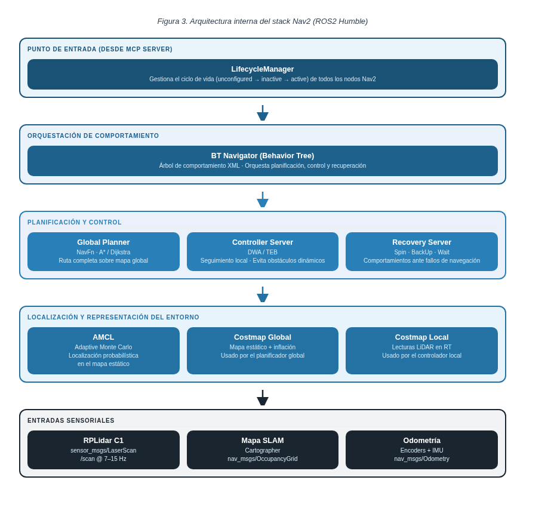

# Capa de Navegación: Nav2

[← Volver al TFM](README.md)

## 1. Introducción a Nav2

**Nav2 (Navigation2)** es la pila oficial de navegación de **ROS2** y el sucesor directo del clásico **ROS Navigation Stack** de ROS1.

Se trata de una reescritura completa adaptada a la arquitectura de ROS2, incorporando:

- **Node lifecycle** para gestionar el estado de los nodos
- **DDS** como mecanismo de comunicación distribuida
- **Nueva API de acciones** para objetivos de navegación y feedback

Su propósito es **planificar y ejecutar rutas** entre la posición actual del robot y una meta dada, utilizando como base el mapa generado por la capa de **SLAM**.

!!! info "Qué aporta Nav2 al sistema"
    Nav2 convierte un objetivo de alto nivel —por ejemplo, *ir a una posición del mapa*— en una secuencia completa de planificación, control, evitación de obstáculos y recuperación ante fallos.

## 2. Arquitectura del stack Nav2

Nav2 sigue una arquitectura modular basada en el patrón **Behavior Trees (BT)**. En lugar de implementar toda la lógica de navegación en un único nodo monolítico, divide el comportamiento en componentes especializados coordinados por un árbol de comportamiento.

### BT Navigator

El componente central es **BT Navigator**, responsable de orquestar la navegación a partir de un archivo XML que define el árbol de comportamiento.

Esto permite modificar el flujo de navegación **sin cambiar código fuente**, por ejemplo para:

- añadir comportamientos de recuperación
- cambiar el planificador global
- alterar condiciones de éxito o reintento
- decidir qué hacer si el controlador local falla

```xml
<BehaviorTree ID="NavigateToPose">
  <Sequence>
    <ComputePathToPose goal="{goal}" path="{path}"/>
    <FollowPath path="{path}"/>
  </Sequence>
</BehaviorTree>
```

### LifecycleManager

El ciclo de vida de los nodos se gestiona mediante **LifecycleManager**, que controla transiciones como:

```text
unconfigured → inactive → active → finalized
```

Este mecanismo garantiza:

- orden correcto de inicialización
- activación sólo cuando las dependencias están disponibles
- parada ordenada del sistema
- mayor robustez ante reinicios o errores parciales

Los nodos gestionados típicamente incluyen:

- planificador global
- controlador local
- servidor de costmaps
- servidor de recovery behaviors

!!! tip "Ventaja práctica"
    En un sistema robótico real, gestionar correctamente el ciclo de vida evita arrancar la navegación antes de que mapa, localización y sensores estén listos.

### Componentes principales de Nav2

| Componente | Rol principal |
|---|---|
| **BT Navigator** | Orquesta la tarea de navegación mediante un Behavior Tree |
| **LifecycleManager** | Gestiona el estado y el orden de activación de los nodos |
| **Global Planner** | Calcula la ruta completa sobre el mapa global |
| **Controller Server** | Sigue la ruta y reacciona a obstáculos dinámicos |
| **Costmap Server** | Mantiene los mapas de costes global y local |
| **Recovery Server** | Ejecuta maniobras de recuperación cuando la navegación falla |
| **AMCL** | Estima la pose del robot sobre el mapa |



## 3. Planificación global y control local

### Global Planner

El **planificador global** calcula la ruta completa desde la posición actual hasta el destino utilizando el mapa global de ocupación.

El planificador de referencia es **NavFn**, que aplica **Dijkstra** o **A\*** sobre el costmap global. En condiciones estáticas, permite obtener rutas óptimas con un coste bien definido.

Alternativas habituales:

- **Theta\***: genera trayectorias más suaves y menos ortogonales
- **Smac Planner**: incorpora mejor restricciones cinemáticas y planificación más avanzada

### Local Controller (Controller Server)

El **controlador local** sigue la ruta global mientras adapta el movimiento a obstáculos o cambios locales del entorno.

Como referencia, se considera **DWA (Dynamic Window Approach)**:

1. genera velocidades lineales y angulares admisibles
2. simula trayectorias candidatas a corto horizonte
3. evalúa cada trayectoria con una función de coste
4. selecciona la que mejor equilibra progreso, distancia a obstáculos y suavidad

```text
coste_total = progreso_hacia_meta + distancia_a_obstaculos + suavidad
```

Para vehículos tipo automóvil, una alternativa especialmente relevante es **TEB (Timed Elastic Band)**, que optimiza la trayectoria como una banda elástica parametrizada en el tiempo y respeta explícitamente restricciones cinemáticas.

!!! warning "Implicación para Robocar"
    Robocar no es un robot diferencial puro, sino un vehículo con dirección tipo **Ackermann**. Por ello, **TEB** encaja mejor conceptualmente que un controlador pensado para cinemática diferencial.

## 4. Costmaps y localización

### Costmaps

Los **costmaps** son mapas 2D donde cada celda recibe un coste en función de su ocupación y de su proximidad a obstáculos.

Nav2 mantiene dos mapas de costes principales:

| Costmap | Fuente | Uso |
|---|---|---|
| **Global** | Mapa estático procedente de SLAM | Planificación global de la ruta |
| **Local** | Sensores en tiempo real, por ejemplo LiDAR | Control local y evitación de obstáculos |

Las capas más habituales son:

- **Static layer**: carga el mapa del entorno
- **Inflation layer**: añade un margen de seguridad alrededor de obstáculos en función del tamaño del robot
- **Obstacle layer**: incorpora lecturas de sensores en tiempo real

!!! info "Por qué dos costmaps"
    El costmap global aporta contexto del entorno completo, mientras que el local responde con rapidez a obstáculos recientes que todavía no forman parte del mapa estático.

### AMCL (Adaptive Monte Carlo Localization)

La localización durante la navegación puede resolverse con **AMCL**, un filtro de partículas que estima la distribución de probabilidad de la pose del robot sobre el mapa.

Su comportamiento adaptativo permite ajustar dinámicamente el número de partículas según la incertidumbre:

- **baja incertidumbre** → menos partículas y menor coste computacional
- **alta incertidumbre** → más partículas y mayor robustez

Esto resulta útil, por ejemplo, tras deslizamientos, colisiones leves, ambigüedad en el entorno o ausencia prolongada de movimiento fiable.

El resultado es una estimación de pose robusta para alimentar al planificador y al controlador durante la navegación.

## 5. Integración con Robocar

En la arquitectura del proyecto, **Nav2** actúa como la capa que ejecuta la navegación autónoma una vez recibida una meta.

El flujo de integración con **MCP Server** es el siguiente:

1. **MCP Server** recibe una instrucción de navegación
2. convierte esa instrucción en un objetivo ROS2 mediante una **acción**
3. **Nav2** planifica la ruta y ejecuta el desplazamiento de forma autónoma
4. Nav2 devuelve estado de **éxito**, **cancelación** o **fallo**
5. **MCP Server** informa al **LLM** del resultado final

```text
LLM → MCP Server → acción ROS2 → Nav2 → resultado → MCP Server → LLM
```

!!! tip "Separación de responsabilidades"
    El LLM decide *qué* hacer. El MCP Server traduce la orden al sistema robótico. Nav2 resuelve *cómo llegar* a la meta usando mapa, localización, planificación y control.
