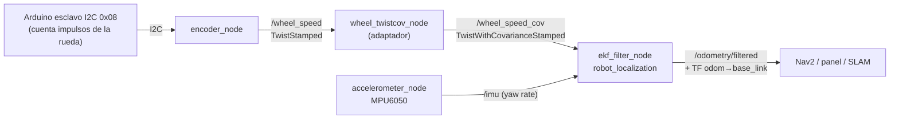

# Odometría: fusión encoder + IMU (EKF)

[← Volver al TFM](README.md)

Este documento describe la **implementación real** de la odometría del robocar (hito **0.4**
de la [Capa 0](fundamentos.md)) y los resultados de su validación rodando. Los fundamentos
teóricos —qué es la odometría, el árbol TF y la decisión de diseño **D2**— están en
[Fundamentos ROS2](fundamentos.md#3-odometria).

!!! abstract "Resumen"
    Se fusiona la **velocidad de la rueda** (encoder) con la **velocidad angular** (giroscopio del
    IMU) mediante un **EKF** de `robot_localization`, produciendo `odom → base_link` y
    `/odometry/filtered`. Validado rodando: **< 1 % de error en distancia** y **~0,17 m de deriva**
    al cerrar un bucle completo.

## 1. Arquitectura

La odometría no la produce un único nodo, sino una pequeña cadena que **desacopla medir de
estimar**: los sensores publican sus medidas y un filtro las fusiona.



| Nodo | Rol | Publica |
|---|---|---|
| `encoder_node` | Lee los impulsos de la rueda por I2C y calcula la velocidad lineal | `/wheel_speed` |
| `wheel_twistcov_node` | Adapta la velocidad a un mensaje con covarianza (el EKF no acepta `TwistStamped`) | `/wheel_speed_cov` |
| `accelerometer_node` | IMU MPU6050 saneado (ver [0.5](fundamentos.md)) | `/imu` |
| `ekf_filter_node` | Fusiona velocidad + giro y estima la pose 2D | `/odometry/filtered`, TF `odom → base_link` |

## 2. El encoder

La rueda tiene una **corona dentada** cuyos impulsos cuenta un **Arduino esclavo** en el bus I2C
(dirección `0x08`).

!!! warning "El 0x08 devuelve una frecuencia, no un contador"
    Un descubrimiento clave: el registro del Arduino **no es un contador acumulativo** (un
    odómetro), sino los **impulsos de la última ventana de 1 s** — es decir, una frecuencia en
    impulsos/segundo, refrescada a ~1 Hz. El nodo lee ese valor **directamente como velocidad**;
    derivarlo como si fuera un contador producía picos de velocidad absurdos.

La conversión a velocidad lineal:

```text
velocidad (m/s) = (impulsos/s / pulses_per_rev) · π · wheel_diameter_m
```

- **`pulses_per_rev = 212`** — medido girando la rueda 10 vueltas exactas e integrando los
  impulsos/segundo (≈ 2118 impulsos / 10 vueltas). Es una corona de alta resolución, no un número
  redondo de dientes.
- **`wheel_diameter_m = 0,068`** — el diámetro medido con regla era 64 mm, pero la validación
  rodando reveló que el **diámetro de rodadura real** es ~68 mm (ver §5).

!!! note "Encoder de un solo canal"
    El sensor no es de cuadratura: no da signo. La velocidad publicada es siempre ≥ 0 (magnitud).
    El sentido de la marcha lo aporta, indirectamente, el resto del sistema.

## 3. El IMU

El giroscopio del MPU6050 aporta la **velocidad angular (yaw rate)**, imprescindible para saber
cómo cambia la orientación del robot. El saneamiento del `/imu` (header, unidades rad/s,
covarianzas) se documenta en el hito 0.5; para la odometría, dos puntos importan:

- **Sólo se fusiona el yaw rate** (`vyaw`). La aceleración lineal no se integra: su bias sin
  calibrar la haría inservible para estimar posición.
- El **bias del giroscopio se auto-calibra al arrancar** (promediando ~100 muestras con el robot
  quieto). Sin esto, el `yaw` derivaba ~3,3 °/s en reposo; tras la corrección, **~0,01 °/s**.

## 4. El EKF (`robot_localization`)

El `ekf_filter_node` mantiene la estimación del estado (pose + velocidad) con su incertidumbre y,
en cada ciclo, **predice** con un modelo de movimiento y **corrige** con las medidas, ponderando
cada fuente según su covarianza. Configuración (`config/ekf.yaml`):

| Parámetro | Valor | Motivo |
|---|---|---|
| `two_d_mode` | `true` | Robot planar (Ackermann): descarta z, roll, pitch |
| `world_frame` | `odom` | Este filtro produce `odom → base_link` (la corrección global `map → odom` es del SLAM) |
| `twist0` | `/wheel_speed_cov` → `vx` | Velocidad lineal del encoder |
| `imu0` | `/imu` → `vyaw` | Velocidad angular del giroscopio |

!!! info "Qué publica"
    - `/odometry/filtered` (`nav_msgs/Odometry`): pose (x, y, yaw) y velocidad fusionadas.
    - La transformación TF **`odom → base_link`**, que consume el resto del stack.

## 5. Validación rodando

Con el coche en el suelo se midió la odometría contra la realidad.

### Distancia (recta)

| Recorrido real | `wheel_diameter_m` | Odometría | Error |
|---|---|---|---|
| 1 m | 0,064 | 0,92 m | −8 % |
| 3 m | 0,064 | 3,02 m *(total)* | −6 % |
| 3 m | **0,068** | ≈ 3,0 m | **< 1 %** |

El defecto sistemático del ~6 % se corrigió afinando el diámetro de 64 → **68 mm** (el diámetro de
rodadura real bajo carga es algo mayor que el medido con regla). Tras el ajuste, la distancia sale
a **menos del 1 %** del valor real.

### Bucle cerrado (recto + giros)

Conduciendo un recorrido cerrado que vuelve al punto de salida:

| Métrica | Resultado |
|---|---|
| **Error de cierre en posición** | **0,17 m** (x = 0,14; y = −0,09) |
| **Error de heading** | **6°** |

!!! success "Interpretación"
    Para una odometría **encoder + IMU sin corrección externa** (sin SLAM ni cierre de bucle), en
    un recorrido cerrado hecho a mano, **17 cm y 6° de deriva por vuelta es un resultado sólido**.
    Confirma que la distancia está bien calibrada y que el giroscopio sigue fielmente los giros.

## 6. Relación con D2 y el SLAM

La [decisión **D2**](fundamentos.md#3-odometria) contempla dos opciones: **A** (pose por
scan-matching de Cartographer) y **B** (fusión encoder + IMU con EKF). Esta implementación cubre la
**opción B** y la deja operativa; ambas conviven bien:

- La odometría (esta tarea) produce `odom → base_link` — movimiento local, suave, que **deriva** a
  largo plazo (esos ~0,17 m por vuelta).
- El [SLAM (Cartographer)](slam.md) produce `map → odom` — la **corrección global** que cancela esa
  deriva, y es quien persigue el objetivo **OE1 (localización < 10 cm)**.

!!! note "Mejoras futuras (opcionales)"
    Dos fuentes adicionales pueden alimentar el mismo EKF si se quisiera reducir la deriva base:
    la **odometría láser** (scan-matching del LIDAR) y el **ángulo de dirección** (modelo de
    bicicleta con la cinemática Ackermann). Dado que el SLAM ya corrige la deriva, no son críticas
    y quedan como trabajo futuro.

## 7. Puesta en marcha

```bash
# La cadena de odometría (adaptador + EKF); requiere el encoder y el IMU corriendo
ros2 launch robocar_pkg ekf.launch.py
```

El `encoder_node` arranca ya con la calibración validada desde `launch.sh` y
`tools/car-panel/launch-panel.sh`:

```bash
ros2 run robocar_pkg encoder_node --ros-args \
  -p pulses_per_rev:=212.0 -p wheel_diameter_m:=0.068
```

La pose se puede observar en vivo en el [panel web](http://robocar.local:8080) (tarjeta
*Odometría · frame odom*: posición x/y y trayectoria sobre un plano fijo).
