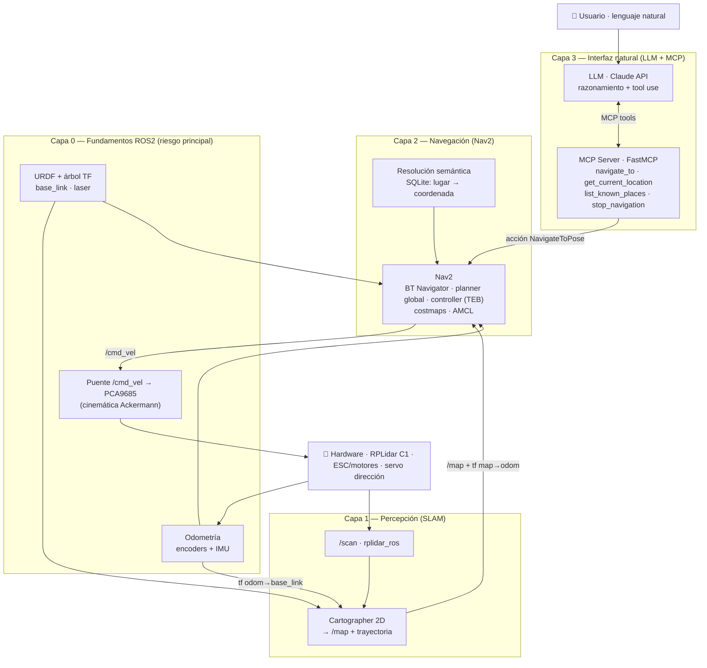

# Roadmap de implementación del TFM

[← Volver al TFM](README.md)

Este documento traduce las **cinco fases** de la metodología (Cap. 3 de la memoria) en un
plan técnico **capa a capa**, marcando qué existe ya, qué falta y **dónde están los riesgos
que la memoria no detalla**. Es el documento de trabajo para las **Entregas 2 y 3**
(Cap. 4 *Desarrollo específico de la contribución* y Cap. 5 *Conclusiones*).

!!! info "Estado global"
    **Entrega 1 completada** (Cap. 1-3: problema, estado del arte, objetivos y metodología).
    La implementación (Cap. 4) **aún no ha comenzado en código**: lo único disponible es la
    validación funcional del RPLidar C1 **fuera de ROS2** (`pruebas/rplidar/`).

Leyenda de estado: ✅ hecho · 🟡 parcial · ⬜ pendiente

## 1. Diagrama conceptual por capas

La solución se organiza en cuatro capas. Las tres capas superiores son las que describe la
memoria (Percepción, Navegación, Interfaz natural); la **Capa 0** recoge los fundamentos ROS2
(URDF/TF, odometría y puente de actuación) que la memoria da por supuestos pero que hay que
construir explícitamente y concentran el mayor riesgo del proyecto.

!!! note "Cómo leer el diagrama"
    El flujo de **control** baja de arriba abajo (usuario → LLM → MCP → Nav2 → hardware) y el
    flujo de **percepción** sube (hardware → `/scan` → Cartographer → Nav2). La Capa 0 sostiene
    a las dos: sin un TF y una odometría coherentes, ni Cartographer ni Nav2 funcionan, y sin el
    puente `/cmd_vel → PCA9685` la salida de Nav2 no llega a las ruedas.

## 2. Roadmap por capas

### Capa 0 — Fundamentos ROS2 *(pre-requisito, no explícito en la memoria)*

Antes de SLAM hay que resolver lo que la metodología da por hecho. La explicación conceptual
detallada (Ackermann, URDF/TF, odometría y por qué es el riesgo principal) está en
[Fundamentos ROS2](fundamentos.md).

- [ ] ⬜ **Fijar la distro ROS2** (ver [Decisión D1](#3-decisiones-de-diseno-abiertas)).
- [ ] ⬜ **URDF + árbol TF**: `base_link`, frame `laser` y transform estático del montaje del LIDAR.
- [ ] ⬜ **Odometría** `odom → base_link` (ver [Decisión D2](#3-decisiones-de-diseno-abiertas), el riesgo mayor).
- [ ] ⬜ **Puente de actuación** `/cmd_vel` (`geometry_msgs/Twist`) → ángulo de servo + throttle ESC vía PCA9685.

!!! warning "Cinemática Ackermann"
    Robocar **no es un robot diferencial**: dirige con un servo (tipo coche). Esto afecta al
    puente de actuación y a la elección de controlador local en la Capa 2. Es la diferencia
    conceptual más importante frente a los tutoriales estándar de Nav2 (pensados para
    TurtleBot diferencial).

### Capa 1 — Percepción / SLAM *(Fase 1 · 3-4 semanas)*

- [ ] 🟡 **Sensor validado** a nivel hardware fuera de ROS2 (`pruebas/rplidar/`) — reutilizable como referencia.
- [ ] ⬜ **`rplidar_ros`** integrado publicando `/scan` (`sensor_msgs/LaserScan`) dentro de ROS2.
- [ ] ⬜ **Cartographer 2D** configurado (`.lua`) y ajustado a Raspberry Pi (resolución y frecuencia de optimización contenidas).
- [ ] ⬜ **Mapa del entorno** construido por teleoperación (mando PS3) y guardado (`.pgm` + `.yaml`).
- [ ] ⬜ **Base de datos SQLite** de lugares semánticos (nombre → coordenada en el mapa; ≥ 3 lugares).

!!! success "Puerta de validación — OE1"
    Mapa coherente y estable + localización reproducible con **error < 10 cm**.

### Capa 2 — Navegación *(Fase 2 · 3-4 semanas)*

- [ ] ⬜ **Nav2** configurado: BT Navigator, planner global (NavFn/Smac), costmaps (static + inflation + obstacle) y AMCL.
- [ ] ⬜ **Controlador local Ackermann**: **TEB** (o Regulated Pure Pursuit / MPPI), **no** el DWB diferencial (ver [Decisión D3](#3-decisiones-de-diseno-abiertas)).
- [ ] ⬜ **Servicio de resolución semántica** (lee la SQLite: nombre de lugar → `PoseStamped`).
- [ ] ⬜ **Navegación punto a punto** validada entre waypoints en entorno controlado.

!!! success "Puerta de validación — OE2"
    **Tasa de éxito > 90 %** (≥ 20 ensayos, destino dentro de radio de 20 cm).

### Capa 3 — Interfaz natural / LLM + MCP *(Fases 3-4 · 4-6 semanas)*

- [ ] ⬜ **MCP Server** en Python con **FastMCP** y las 4 herramientas: `navigate_to()`, `get_current_location()`, `list_known_places()`, `stop_navigation()`.
- [ ] ⬜ **Cliente de acción `rclpy`** contra `NavigateToPose` (envío de meta, feedback, éxito/fallo/cancelación).
- [ ] ⬜ **Host + Claude API**: system prompt del asistente de navegación y bucle conversacional con *tool use*.

!!! success "Puertas de validación — OE3 / OE4"
    Herramientas invocables manualmente con comportamiento correcto (OE3) y **pipeline
    end-to-end** desde texto del usuario hasta movimiento del robot (OE4).

!!! tip "Se puede adelantar"
    El MCP Server puede desarrollarse y probarse contra un **Nav2 simulado (mock)** sin esperar
    a que la Capa 2 esté cerrada, para no bloquear el trabajo de la interfaz.

### Capa 4 — Validación y cierre *(Fase 5 · 2-3 semanas)*

- [ ] ⬜ **Batería de pruebas** end-to-end: comandos simples, secuencias compuestas y casos de error.
- [ ] ⬜ **Toma de métricas** (OE1-OE4) y refinamiento de casos de fallo.
- [ ] ⬜ **Redacción** del Cap. 4 (desarrollo) y Cap. 5 (conclusiones y líneas futuras) + Resumen/Abstract.

## 3. Decisiones de diseño abiertas

Decisiones que condicionan el resto del trabajo y conviene cerrar cuanto antes.

| ID | Decisión | Opciones | Recomendación inicial |
|---|---|---|---|
| **D1** | Distro ROS2 | Iron (repo/README) vs **Humble** (memoria, LTS) | **Humble**: es lo que dice la memoria, es LTS y tiene el mejor soporte para Nav2, Cartographer y `rplidar_ros` en la Pi. Alinear repo y documento. |
| **D2** | Fuente de odometría/localización | **A)** pose por *scan-matching* de Cartographer (sin odometría de ruedas fiable). **B)** fusión encoders + IMU con `robot_localization` (EKF) + AMCL | **Empezar por A** para desbloquear mapa y navegación rápido; migrar a **B** si la deriva impide cumplir OE1 (< 10 cm). La opción B **no está en la memoria** y habría que añadirla al Cap. 4. |
| **D3** | Controlador local Nav2 | DWB (diferencial) vs **TEB** / Regulated Pure Pursuit / MPPI (Ackermann) | **TEB** por la cinemática tipo coche (la propia memoria lo señala). |
| **D4** | Puente de actuación | Extender `car_control_node` con un modo "autónomo Nav2" vs nodo nuevo `cmd_vel → PCA9685` | Nodo/modo que traduzca `Twist` a ángulo de dirección + throttle respetando límites Ackermann. |

## 4. Camino crítico y riesgos

!!! danger "Dónde se atascan los TFM de robótica"
    El riesgo **no está en el LLM ni en el MCP** (es la parte más acotada y controlable), sino
    en la **Capa 0-2**: TF, odometría y el puente Ackermann. Ahí conviene invertir el esfuerzo.

- **Secuencialidad estricta hasta la Capa 3**: sin `/scan` en ROS2 no hay mapa; sin mapa no hay
  Nav2; sin Nav2 no hay acción que el MCP invoque. La única paralelización razonable es
  adelantar el MCP Server contra un Nav2 *mock*.
- **Cómputo en la Pi 4 (4 GB)**: `rplidar_ros` + Cartographer + Nav2 juntos van justos pero son
  viables (equivalente a TurtleBot3). El LLM corre **fuera** de la Pi vía Claude API, así que no
  añade carga local.
- **Odometría Ackermann**: es la incógnita técnica principal (Decisión D2) y afecta directamente
  a OE1 y OE2.

## 5. Correspondencia fases ↔ capas ↔ objetivos

| Fase (memoria) | Capa (este roadmap) | Objetivo | Métrica |
|---|---|---|---|
| Fase 1 · SLAM y mapa semántico | Capa 0 + Capa 1 | OE1 | Error localización < 10 cm |
| Fase 2 · Navegación con Nav2 | Capa 2 | OE2 | Éxito navegación > 90 % |
| Fase 3 · MCP Server | Capa 3 | OE3 | 4 tools operativas |
| Fase 4 · Integración con LLM | Capa 3 | OE4 | Interpretación NL > 85 % |
| Fase 5 · Pruebas y evaluación | Capa 4 | OE1-OE4 | + latencia mediana < 5 s |

## 6. Pendientes de la memoria *(pulido, no urgente)*

- **Distro descuadrada**: el repo/README indica **Iron** y la memoria **Humble** (Decisión D1).
- **Referencias de los TFG previos**: en la bibliografía la autoría/año de los dos TFG aparece
  cruzada respecto al cuerpo del texto (construcción como 2023 individual, lane-following como
  2024 a dos autores; en el cuerpo es al revés). Revisar antes de la entrega final.
- **Odometría/EKF**: si se adopta la opción D2-B, documentarla en el Cap. 4.
