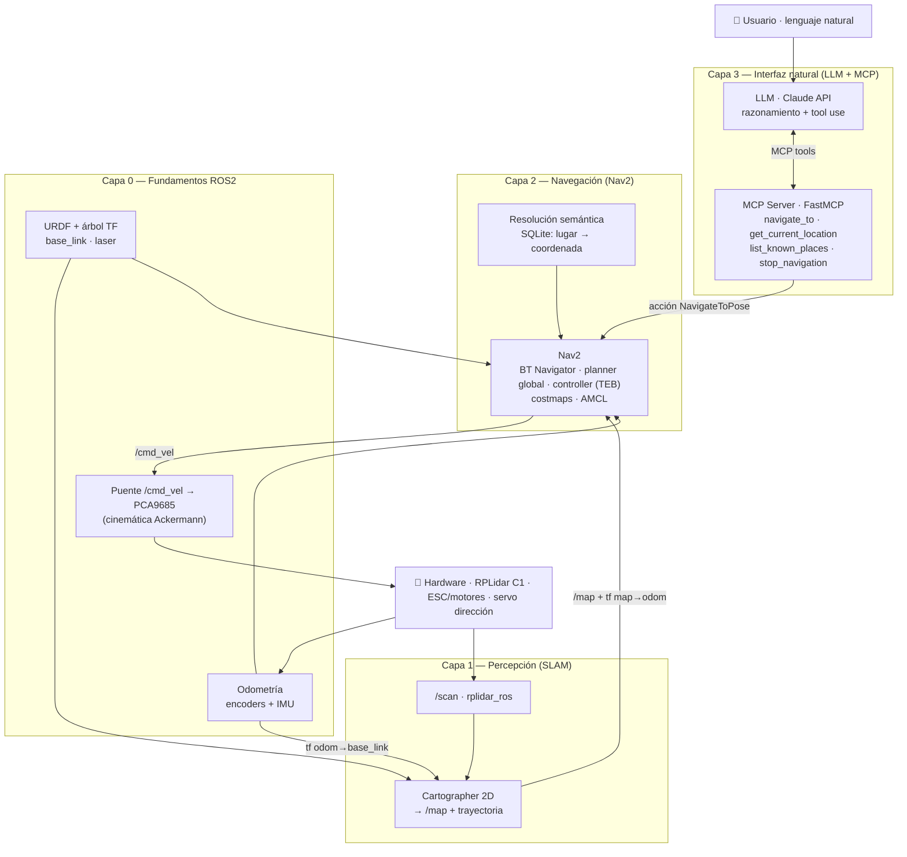
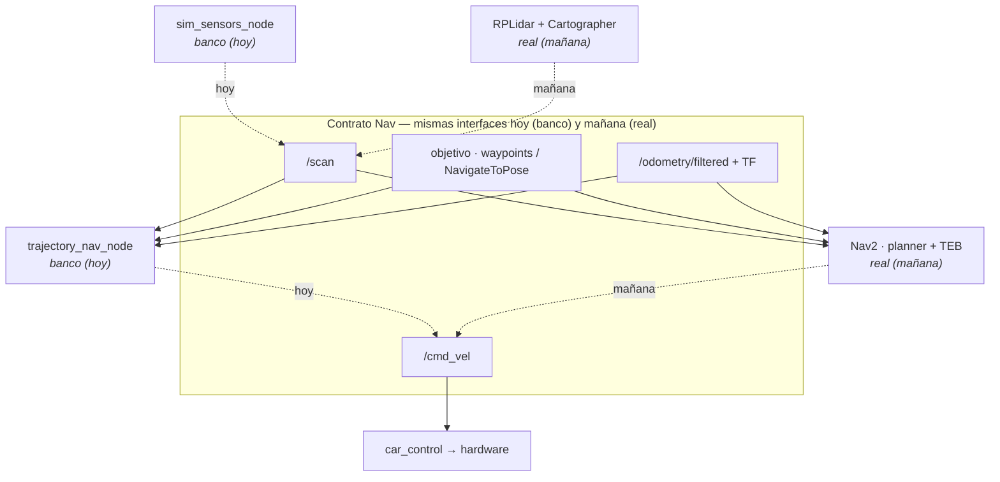

# Roadmap de implementación del TFM

[← Volver al TFM](README.md)

!!! tip "📊 El estado vivo del proyecto está en el tablero: [roadmap.iawiki.app](https://roadmap.iawiki.app)"
    Tareas, subtareas, dependencias, **Gantt auto-programado**, camino crítico e historial —
    todo se gestiona en el **[tablero web compartido](https://roadmap.iawiki.app)**
    (código en `tools/roadmap-web/`). Esta página recoge únicamente el **marco conceptual**
    que da contexto a la memoria: capas, decisiones de diseño y riesgos.

## Diagrama conceptual por capas

La solución se organiza en cuatro capas. Las tres superiores son las que describe la memoria
(Percepción, Navegación, Interfaz natural); la **Capa 0** recoge los fundamentos ROS2
(URDF/TF, odometría y puente de actuación) que la memoria da por supuestos y que concentran
el riesgo técnico — su explicación detallada está en [Fundamentos ROS2](fundamentos.md).

El **panel de control web** (`tools/car-panel/`, servido desde el propio vehículo) es
**transversal a todas las capas**: cada una aterriza visualmente en él (scan y sensores hoy;
mapa, navegación y chat LLM conforme avancen las capas). Actúa como mecanismo de observación
y pruebas de todo el sistema.

## Banco de simulación — preparatoria de la Capa 2 (Navegación)

Antes de cablear Nav2 + Cartographer sobre el hardware real, validamos la lógica de navegación
(seguimiento de trayectoria, evitación de obstáculos, maniobras Ackermann) en un **banco de
simulación** que corre en el propio vehículo, con las ruedas al aire. La **clave de diseño**:
el banco **habla exactamente las mismas interfaces que Nav** — mismos *topics*, tipos, *frames*
y restricciones cinemáticas — de modo que sustituir el banco por la pila real (mapa de
Cartographer + planificador/controlador de Nav2) sea un **_drop-in_**, sin reescribir nada
aguas arriba ni aguas abajo. Dicho de otro modo: **el banco tiene que responder a lo que Nav
va a ser**, no a un simulador ad-hoc que luego haya que tirar.

Componentes actuales del banco y a qué corresponden en la pila real:

| Banco (hoy) | Sustituye a (Capa 1-2) | Interfaz — **idéntica** en banco y en real |
|---|---|---|
| Mapa dibujado en web (**plantas de piso 100-200 m² con muebles**) → `sim_sensors_node` | El **`/map`** (OccupancyGrid) que producirá **Cartographer** (Capa 1) | el "mundo" que percibe el robot |
| `sim_sensors_node` (ray-cast del mapa desde la pose) | El **RPLidar C1** real (`rplidar_ros`) | **`/scan`** (`sensor_msgs/LaserScan`, frame `laser`/`base_link`) — lo consume la capa de obstáculos del *costmap* |
| **`sim_motion_node`** (integra `/cmd_vel` con el modelo de bicicleta) | El **robot físico + su odometría** (EKF encoder+IMU+dirección) en el suelo | **`/odometry/filtered`** + TF `odom→base_link` |
| Waypoints dibujados en web (`/plan_waypoints`) | El **objetivo** (`NavigateToPose` / `/goal_pose`) que fija Nav2 / el LLM | pose(s) objetivo |
| `trajectory_nav_node` (go-to-goal + evitación + k-turn) | El **planner global + controlador local (TEB)** de Nav2 | **`/cmd_vel`** (`geometry_msgs/Twist`) → `car_control` |

**La "planta" del banco (cómo se mueve el robot).** El banco corre en modo **simulación cinemática
pura**: `sim_motion_node` integra `/cmd_vel` con el modelo de bicicleta Ackermann
(ω = v·tan δ/L, con los **mismos** `L`, `tan_max`, `max_angular` que la odometría de dirección)
y publica `/odometry/filtered` + TF `odom→base_link` **sin depender de ruedas/encoder/IMU/EKF**.
Así el robot simulado gira con el **mismo radio mínimo real (R_min ≈ 0.93 m)** y dispara el
**k-turn** igual que en el suelo, pero de forma **reproducible y sin hardware** (validado: recto
0.3 m/s→0.61 m; arco a tope→37.7°, radio 0.93 m; lazo completo con `trajectory_nav`). El modo
alternativo **hardware-in-the-loop** (ruedas al aire + encoder/IMU/EKF reales, `bringupF`) queda
para validar la **cadena real de actuación y odometría** antes de bajar al suelo. En ambos, todo
lo demás (mapa, sensores, navegador, web) es idéntico.

Por eso las **plantas de piso** de la web no son decorativas: son el *stand-in* del mapa que
mañana dará el SLAM, con geometría realista para pisos de 100-200 m² (pasillos, puertas ~0.8 m,
muebles como obstáculos). Validar aquí que el coche recorre trayectorias correctas y esquiva
**respetando su radio de giro mínimo real (R_min ≈ 0.93 m → _k-turn_ en giros cerrados)**
de-risquea directamente el *tuning* de TEB en la Capa 2, porque el controlador de Nav2 tendrá
que respetar esa misma restricción Ackermann.

**Para que el banco sea un _drop-in_ fiel de Nav (convergencia pendiente):**

1. ✅ **HECHO** — Publicar el mapa dibujado también como **`/map` (`nav_msgs/OccupancyGrid`)**:
   `sim_map_grid_node` rasteriza los segmentos (`/sim_map`) a rejilla de ocupación (celdas
   pared=100, libre=0, 0.05 m/celda), QoS `transient_local` (latched) + republish 1 Hz. Alimenta
   la **capa estática del _costmap_** de Nav2 con el mismo mapa de banco. Pintado también en la web.
2. Exponer el objetivo como **`NavigateToPose` / `/goal_pose`** (además de `/plan_waypoints`),
   que es lo que emitirá el MCP/LLM de la Capa 3.
3. Cerrar el **árbol TF** que espera Nav2: `map→odom` (**ya emitido** por `sim_map_grid` como
   identidad estática en banco; en real lo dará AMCL/SLAM), `odom→base_link` (odometría, ✅) y
   `base_link→laser` (pendiente de comprobar en el URDF).
4. Con esas tres piezas, el `trajectory_nav_node` se **sustituye por Nav2** (BT Navigator +
   planner + TEB) **sin tocar** ni la web, ni `sim_sensors`, ni `sim_motion`. Ese es el criterio
   de "banco bien hecho". Recordatorio de reparto: **Nav2 hace la ruta** (planner global sobre el
   `/map`) **y la conduce** (controller TEB); nosotros solo damos el **destino** — hoy la ruta la
   dibujamos a mano en la web con `trajectory_nav`, que es el andamio a retirar.

> **Estado del banco (sim puro):** ✅ `sim_motion` (planta cinemática), ✅ `/scan` (sim_sensors),
> ✅ `/map` + TF `map→odom` (sim_map_grid), ✅ TF `odom→base_link` (sim_motion). **Falta** para
> Nav2: comprobar `base_link→laser` en el URDF, exponer `/goal_pose`, e instalar+configurar Nav2.

## Decisiones de diseño

| ID | Decisión | Resolución |
|---|---|---|
| **D1** | Distro ROS2 | **Humble** (LTS hasta 2027, alineada con la memoria). Migración realizada. |
| **D2** | Odometría/localización | **Opción A**: pose por *scan-matching* de Cartographer. Plan B (fusión encoder+IMU+dirección → odometría modelo-bicicleta) **implementado y validado** en Capa 0 (~±1.5 % / ~2 cm a 30 Hz), disponible si no se cumple OE1 (<10 cm) y como base para el banco. |
| **D3** | Controlador local Nav2 | **TEB** (o RPP/MPPI) por la cinemática Ackermann — no el DWB diferencial. Datos **medidos**: L=0.175 m, **radio de giro mín. R_min ≈ 0.93 m** (tan_max=0.188, ~10.6° de rueda a tope), velocidad mínima conducible **~0.3 m/s** (el ESC/BLHeli no hace *crawl* fino). **Marcha atrás disponible** (con pausa en neutro) → **maniobras en 3 puntos (k-turn)** para giros por debajo de R_min. TEB deberá respetar esta misma restricción y, idealmente, permitir reversa. |
| **D4** | Puente de actuación | `car_control_node` extendido (único dueño del bus I2C): `/cmd_vel` → servo dirección + ESC, con rampa anti-pico, watchdog y neutro garantizado. |

## Correspondencia fases ↔ capas ↔ objetivos

| Fase (memoria) | Capa | Objetivo | Métrica |
|---|---|---|---|
| Fase 1 · SLAM y mapa semántico | Capa 0 + Capa 1 | OE1 | Error localización < 10 cm |
| Fase 2 · Navegación con Nav2 | Capa 2 | OE2 | Éxito navegación > 90 % |
| Fase 3 · MCP Server | Capa 3 | OE3 | 4 tools operativas |
| Fase 4 · Integración con LLM | Capa 3 | OE4 | Interpretación NL > 85 % |
| Fase 5 · Pruebas y evaluación | Capa 4 | OE1-OE4 | + latencia mediana < 5 s |

> **Trabajo actual** (banco de simulación con plantas de piso + `trajectory_nav`) es
> **preparatoria de la Fase 2 / Capa 2**: valida el seguimiento de trayectoria y la evitación
> contra las **mismas interfaces** que consumirá Nav2 (ver sección *Banco de simulación*). La
> Capa 0 (odometría, actuación, TF) ya está validada y es la base sobre la que se monta.

## Riesgos estructurales

- **Capa 0 como cuello de botella**: TF, odometría y actuación Ackermann son el trabajo
  "invisible" del que depende todo lo demás (ver [Fundamentos ROS2](fundamentos.md)).
  *Estado:* odometría y actuación **validadas**; queda cerrar el árbol TF completo para Nav2.
- **Cómputo en la Raspberry Pi 4**: LIDAR + Cartographer + panel comparten CPU; el tuning
  de Cartographer (submaps y optimización contenidos) es parte del diseño.
- **Alimentación única** (batería → ESC + BUCK 5V compartido): las entradas de acelerador
  en escalón provocan caídas de tensión; se gestiona con rampas por software y protocolo
  operativo (el hardware no se modifica, por decisión de proyecto).
- **Fidelidad del banco**: el banco simulado sólo es útil si mantiene el **contrato de
  interfaces** con Nav2 (topics/tipos/frames/cinemática). Cualquier atajo que rompa ese
  contrato (p. ej. lógica de control que no salga por `/cmd_vel`, o sensores que no salgan por
  `/scan`) invalida la preparación. Ver checklist de convergencia arriba.
