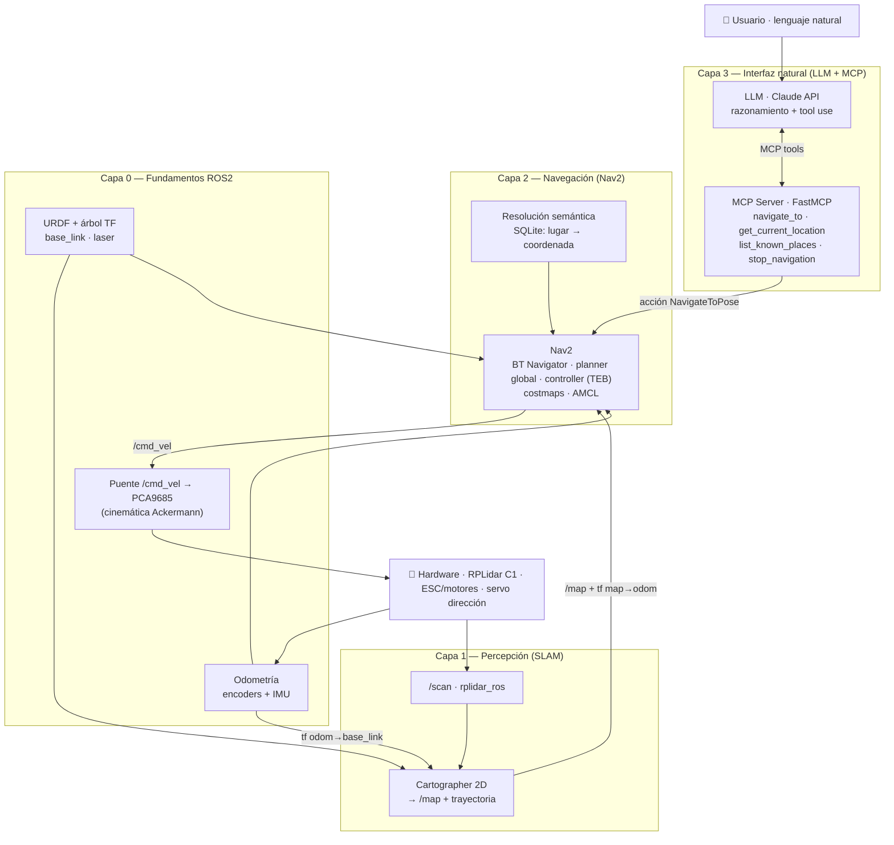

# Roadmap de implementación del TFM

[← Volver al TFM](README.md)

!!! tip "📊 El estado vivo del proyecto está en el tablero: [roadmap.iawiki.app](https://roadmap.iawiki.app)"
    Tareas, subtareas, dependencias, **Gantt auto-programado**, camino crítico e historial —
    todo se gestiona en el **[tablero web compartido](https://roadmap.iawiki.app)**
    (código en `tools/roadmap-web/`). Esta página recoge únicamente el **marco conceptual**
    que da contexto a la memoria: capas, decisiones de diseño y riesgos.

## Diagrama conceptual por capas

La solución se organiza en cuatro capas. Las tres superiores son las que describe la memoria
(Percepción, Navegación, Interfaz natural); la **Capa 0** recoge los fundamentos ROS2
(URDF/TF, odometría y puente de actuación) que la memoria da por supuestos y que concentran
el riesgo técnico — su explicación detallada está en [Fundamentos ROS2](fundamentos.md).

El **panel de control web** (`tools/car-panel/`, servido desde el propio vehículo) es
**transversal a todas las capas**: cada una aterriza visualmente en él (scan y sensores hoy;
mapa, navegación y chat LLM conforme avancen las capas). Actúa como mecanismo de observación
y pruebas de todo el sistema.

## Decisiones de diseño

| ID | Decisión | Resolución |
|---|---|---|
| **D1** | Distro ROS2 | **Humble** (LTS hasta 2027, alineada con la memoria). Migración realizada. |
| **D2** | Odometría/localización | **Opción A**: pose por *scan-matching* de Cartographer. Plan B preparado (fusión encoder+IMU → odometría modelo-bicicleta) si no se cumple OE1 (<10 cm). |
| **D3** | Controlador local Nav2 | **TEB** (o RPP/MPPI) por la cinemática Ackermann — no el DWB diferencial. Datos ya disponibles: L=0.175 m, radio de giro mín. 0.175 m, velocidad operativa 0.18 m/s. |
| **D4** | Puente de actuación | `car_control_node` extendido (único dueño del bus I2C): `/cmd_vel` → servo dirección + ESC, con rampa anti-pico, watchdog y neutro garantizado. |

## Correspondencia fases ↔ capas ↔ objetivos

| Fase (memoria) | Capa | Objetivo | Métrica |
|---|---|---|---|
| Fase 1 · SLAM y mapa semántico | Capa 0 + Capa 1 | OE1 | Error localización < 10 cm |
| Fase 2 · Navegación con Nav2 | Capa 2 | OE2 | Éxito navegación > 90 % |
| Fase 3 · MCP Server | Capa 3 | OE3 | 4 tools operativas |
| Fase 4 · Integración con LLM | Capa 3 | OE4 | Interpretación NL > 85 % |
| Fase 5 · Pruebas y evaluación | Capa 4 | OE1-OE4 | + latencia mediana < 5 s |

## Riesgos estructurales

- **Capa 0 como cuello de botella**: TF, odometría y actuación Ackermann son el trabajo
  "invisible" del que depende todo lo demás (ver [Fundamentos ROS2](fundamentos.md)).
- **Cómputo en la Raspberry Pi 4**: LIDAR + Cartographer + panel comparten CPU; el tuning
  de Cartographer (submaps y optimización contenidos) es parte del diseño.
- **Alimentación única** (batería → ESC + BUCK 5V compartido): las entradas de acelerador
  en escalón provocan caídas de tensión; se gestiona con rampas por software y protocolo
  operativo (el hardware no se modifica, por decisión de proyecto).
