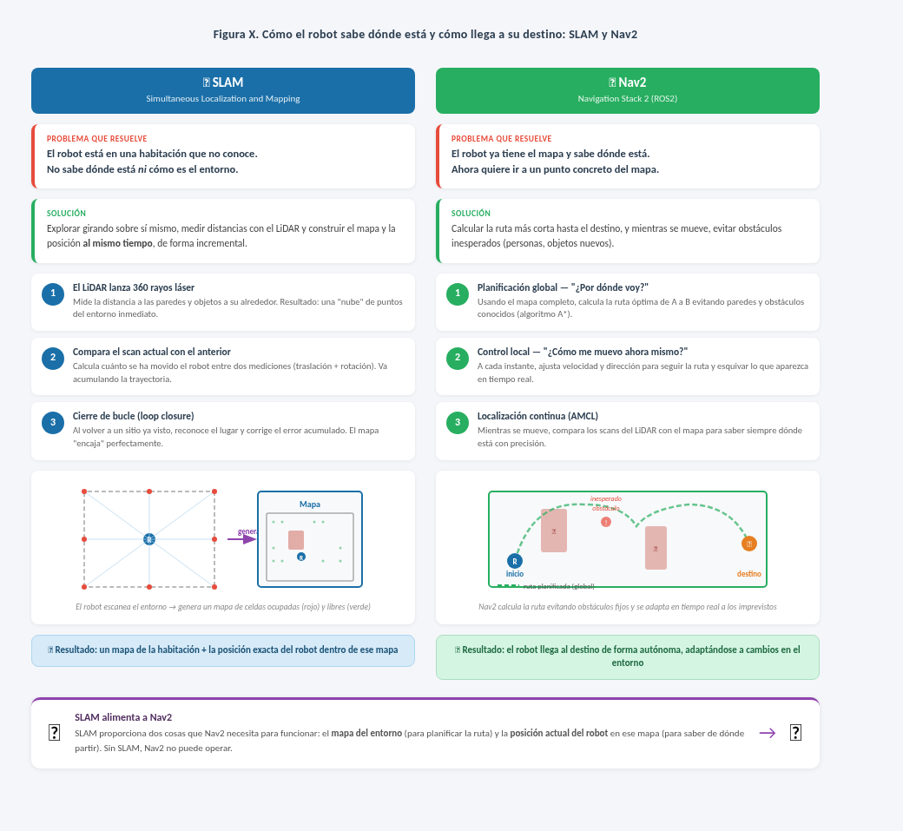

# Capa de Percepción: SLAM

[← Volver al TFM](README.md)

La capa de percepción basada en **SLAM** es la responsable de construir un mapa métrico del entorno y estimar en tiempo real la posición del robot sobre ese mapa. En este proyecto se utiliza una estrategia **2D LiDAR SLAM** orientada a interiores domésticos y pensada para ejecutarse en una **Raspberry Pi** con integración directa con **ROS2** y **Nav2**.

!!! info "Objetivo dentro del proyecto"
    Esta capa transforma las medidas del LiDAR en tres salidas fundamentales para navegación: **mapa de ocupación**, **localización global** y **árbol de transformaciones `tf2`** (`map → odom → base_link`).

## 1. Fundamentos del SLAM

**SLAM** (*Simultaneous Localization and Mapping*) resuelve de forma simultánea dos problemas acoplados:

- **Localización**: estimar el estado del robot `x` a lo largo del tiempo.
- **Mapeado**: construir el mapa `m` del entorno a partir de las observaciones `z` y del movimiento aplicado `u`.

De forma formal, el problema consiste en estimar la probabilidad conjunta:

```text
P(x₁:ₜ, m | z₁:ₜ, u₁:ₜ)
```

Donde:

- `x₁:ₜ` es la trayectoria del robot
- `m` es el mapa
- `z₁:ₜ` son las observaciones de sensores
- `u₁:ₜ` son los comandos o incrementos de movimiento

El reto principal es cíclico:

- para localizarse bien hace falta un mapa fiable
- para construir bien el mapa hace falta conocer la posición del robot

!!! note "Cierre de bucle"
    El concepto más importante en una implementación práctica es el **loop closure** o cierre de bucle: detectar que el robot ha vuelto a una zona ya visitada para corregir el **drift** acumulado y reajustar el mapa global.

### Enfoques modernos

Los enfoques más habituales en robótica móvil son:

- **Filtros de partículas** como **FastSLAM**
- **EKF-SLAM** basado en filtro de Kalman extendido
- **Optimización gráfica** mediante **pose graphs**

En este TFM interesa especialmente el tercer grupo, porque los sistemas modernos orientados a ROS2 y navegación suelen combinar:

- estimación local rápida para mantener la pose en tiempo real
- optimización global cuando aparecen cierres de bucle

## 2. Tipos de SLAM y comparativa

La elección del tipo de SLAM depende del sensor principal, del entorno y del presupuesto computacional.

| Tipo | Sensores principales | Referencias | Ventajas | Limitaciones | Adecuación al proyecto |
|---|---|---|---|---|---|
| **Visual SLAM (VSLAM)** | Cámaras monoculares o estéreo | ORB-SLAM3, RTAB-Map | Hardware barato, mucha información visual | Sensible a iluminación, reflejos y falta de textura | Media |
| **LiDAR SLAM** | LiDAR 2D/3D por ToF o triangulación | Cartographer, LOAM, FAST-LIO2 | Medida métrica precisa, robusto a cambios de luz | Sensor más específico y coste mayor que una cámara | Muy alta |
| **Visual-Inertial SLAM** | Cámara + IMU | VINS-Mono, ORB-SLAM3-VI | Mejor respuesta ante movimientos rápidos | Mayor complejidad de calibración y sincronización | Media |
| **RGB-D SLAM** | Cámara RGB-D | RTAB-Map, soluciones con RealSense | Información geométrica y semántica más rica | Sensor más caro y sensible al rango útil | Media |
| **Híbrido multi-sensor** | LiDAR + cámaras + IMU | LVI-SAM, R3LIVE | Máxima robustez | Integración y cómputo elevados | Baja |

### Comparativa resumida

| Enfoque | Tasa de éxito típica en interiores | Observación práctica |
|---|---|---|
| **Visual SLAM** | 60–70 % | Penalizado por paredes lisas, zonas oscuras y cambios de iluminación |
| **LiDAR SLAM** | 90–95 % | Muy consistente en interiores domésticos y pasillos |
| **Visual-Inertial** | Superior a VSLAM puro | Mejora estabilidad, pero sigue dependiendo de la calidad visual |

!!! tip "Decisión de diseño"
    Para este proyecto se selecciona **LiDAR SLAM 2D** porque ofrece mejor robustez en interiores domésticos con paredes lisas, iluminación variable y necesidad de una **geometría métrica fiable** para Nav2.

### Motivos concretos de la elección

1. **Robustez frente a la iluminación**: el mapa no depende de textura ni de luz ambiente.
2. **Precisión métrica**: el dato de distancia del LiDAR es directamente utilizable para ocupación y planificación.
3. **Integración ROS2**: la salida encaja de forma natural con `nav_msgs/OccupancyGrid`, `sensor_msgs/LaserScan` y `tf2`.
4. **Simplicidad de la pila**: evita calibraciones visuales complejas en una plataforma embebida.
5. **Compatibilidad con Nav2**: la navegación consume exactamente los productos típicos de un SLAM LiDAR 2D.

## 3. Cartographer

**Cartographer** es el sistema de SLAM desarrollado por Google y uno de los referentes para mapeado y localización en ROS. Soporta modos **2D** y **3D**, aunque en este proyecto se emplea la variante **2D** por adecuación al hardware y al entorno.

### Arquitectura funcional

Cartographer se apoya en dos módulos complementarios:

#### 3.1 Seguimiento local

Mantiene la pose del robot dentro de un **submapa local** combinando:

- integración temporal de movimiento
- **filtrado tipo Kalman** para estabilizar la estimación local
- **scan matching** entre el escaneo actual y la geometría ya observada

Su objetivo es mantener una estimación estable a corto plazo incluso aunque el mapa global aún no esté optimizado.

#### 3.2 Optimización global y cierre de bucle

Cuando el robot vuelve a una zona conocida, Cartographer detecta la correspondencia y optimiza el **grafo global de poses**. Para ello utiliza una búsqueda **branch-and-bound** sobre una rejilla jerárquica y reajusta la trayectoria completa para reducir el error acumulado.

El resultado es un mapa coherente a escala global y una mejor consistencia entre exploraciones separadas en el tiempo.

!!! info "Qué publica en ROS2"
    Cartographer genera exactamente los mensajes que necesita la capa de navegación:

    - **Mapa de ocupación** (`nav_msgs/OccupancyGrid`)
    - **Transformaciones `tf2`** (`map → odom → base_link`)
    - **Trayectoria estimada** del robot

### Flujo de datos en el proyecto

```text
RPLidar C1 → /scan (sensor_msgs/LaserScan)
           → Cartographer
           → /map (nav_msgs/OccupancyGrid)
           → tf: map → odom → base_link
           → pose estimada / trayectoria
           → Nav2 (costmaps, localización y planificación)
```



### Parámetros de configuración relevantes

En una Raspberry Pi no interesa usar una configuración agresiva. Los parámetros más sensibles son:

| Parámetro | Impacto en el sistema |
|---|---|
| **Frecuencia del LiDAR** | Determina la cadencia de actualización del SLAM |
| **Resolución del mapa / submapas** | Más resolución mejora detalle, pero aumenta CPU y memoria |
| **Umbrales de scan matching** | Ajustan la tolerancia a emparejamientos incorrectos |
| **Frecuencia de loop closure** | Afecta al coste de la optimización global |
| **Tamaño y duración de submapas** | Cambia el equilibrio entre detalle local y coste computacional |

!!! note "Ajustes recomendados para Raspberry Pi"
    Para mantener ejecución en tiempo real se prioriza:

    - **resolución moderada** de submapas
    - **frecuencia contenida** de optimización global
    - límites conservadores en scan matching para evitar falsas asociaciones

### Motivo de la elección de Cartographer

Frente a otras alternativas, Cartographer encaja bien en este TFM porque:

- es una referencia consolidada para **SLAM 2D indoor**
- trabaja directamente sobre `LaserScan`
- produce `map`, `tf` y trayectoria sin capas intermedias adicionales
- su salida se integra de forma natural con **Nav2**

## 4. Hardware: RPLidar C1

El sensor seleccionado para la percepción SLAM es el **RPLidar C1** de **Slamtec**, conectado por **USB-UART** y publicado en ROS2 mediante el paquete `rplidar_ros`.

| Especificación | Valor |
|---|---|
| Fabricante | Slamtec |
| Tecnología | DTOF (Direct Time-of-Flight) |
| Cobertura | 360° |
| Rango máximo | 12 m |
| Frecuencia de muestreo | 5.000 puntos/s |
| Frecuencia de rotación | 7–15 Hz |
| Precisión | ±1 cm |
| Peso | < 100 g |
| Interfaz | USB-UART |
| Driver ROS2 | `rplidar_ros` |
| Topic | `/scan` (`sensor_msgs/LaserScan`) |

### Por qué DTOF es relevante en este proyecto

El uso de tecnología **DTOF** aporta una ventaja práctica frente a sensores basados en triangulación láser:

- mejor comportamiento ante superficies reflectantes
- menor degradación frente a materiales negros o absorbentes
- mayor consistencia en interiores domésticos reales

Esto es importante porque el robot debe operar en un entorno no controlado, con muebles, esquinas, variaciones de acabado y paredes de textura pobre.

!!! tip "Integración directa"
    El flujo de percepción no requiere preprocesado complejo: el LiDAR publica `/scan`, y esa misma información alimenta tanto a **Cartographer** como a los **costmaps** de Nav2.

## 5. Integración en la arquitectura ROS2 del proyecto

Dentro de la pila de software del TFM, la capa SLAM se sitúa entre el sensor de distancia y la navegación global:

1. **`rplidar_ros`** adquiere el barrido y publica `/scan`
2. **Cartographer** estima la pose y construye el mapa
3. **Nav2** consume el mapa y las transformaciones para localizar y planificar
4. El resto de nodos de control ejecutan la maniobra resultante

### Interfaces ROS2 implicadas

| Elemento | Tipo | Función |
|---|---|---|
| `/scan` | `sensor_msgs/LaserScan` | Entrada principal del SLAM |
| `/map` | `nav_msgs/OccupancyGrid` | Mapa global para navegación |
| `tf: map → odom → base_link` | `tf2` | Marco espacial completo del robot |
| Trayectoria estimada | Mensajes internos/publicados por Cartographer | Seguimiento de pose y optimización global |

## 6. Decisiones de implementación

### Selección final

La solución elegida para la capa de percepción es:

```text
RPLidar C1 + rplidar_ros + Cartographer 2D + Nav2
```

### Razones principales

- **Más fiable que una cámara** en interiores con iluminación variable
- **Menor complejidad** que una solución visual-inercial o multi-sensor
- **Mejor relación entre precisión y coste computacional** en una Raspberry Pi
- **Salida directamente consumible por Nav2**

### Límites asumidos

También se aceptan varias restricciones de diseño:

- el mapa es **2D**, por lo que no modela alturas ni obstáculos suspendidos
- la calidad del SLAM depende de la estructura geométrica del entorno
- una frecuencia de optimización global demasiado alta penaliza la ejecución embebida

!!! note "Alcance del TFM"
    La prioridad no es maximizar complejidad algorítmica, sino disponer de una solución **estable, reproducible y desplegable** en el vehículo real. Por eso se descartan alternativas 3D y fusiones multi-sensor pesadas como **FAST-LIO2**, **LVI-SAM** o **R3LIVE**.

## 7. Resumen

La capa de percepción SLAM del TFM adopta una estrategia **LiDAR 2D** por ser la opción más sólida para un robot móvil pequeño que trabaja en interiores domésticos. La combinación de **RPLidar C1** y **Cartographer** permite:

- construir un mapa de ocupación utilizable por Nav2
- localizar el robot de forma consistente en el entorno
- corregir deriva mediante **loop closure**
- mantener un coste computacional compatible con Raspberry Pi

Con esta decisión, la percepción deja de depender de condiciones visuales y pasa a apoyarse en una representación geométrica directamente útil para navegación autónoma.
